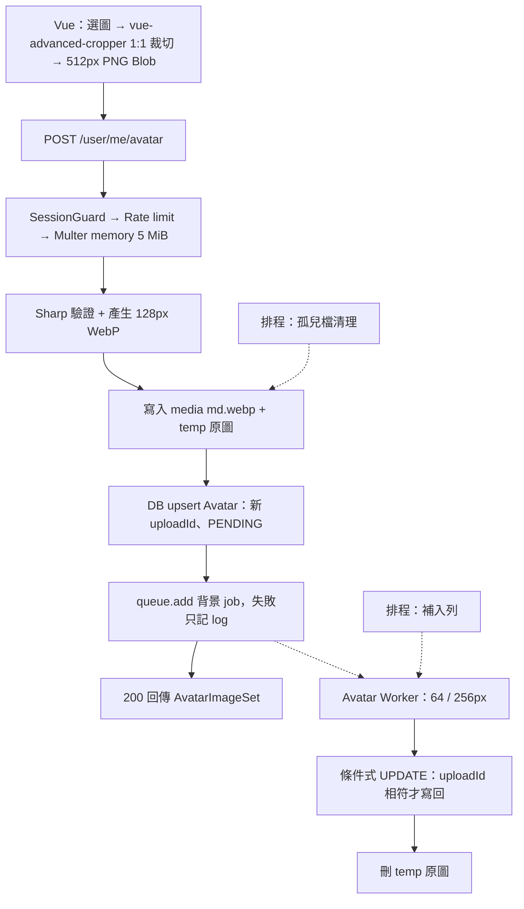

# Kanban Avatar 功能規格與實作計畫

日期：2026-09-29。狀態：**設計定案，尚未實作**。

> **2026-09-30 過渡狀態**：`avatars` schema 與 migration `20260930153339_add_avatar_model` 已建立，`users.avatar_url` 已移除。在上傳功能完成前，所有公開 contract（`PublicUser`、Workspace／Project 成員、候選人）與通知 read model 都**暫時不含頭像欄位**，後端測試也已移除相關斷言。前端 `ProjectMembers`、`ProjectAddMemberDialog` 只顯示首字佔位，並以 `TODO(avatar)` 標記。§4.2 的欄位會在實作階段連同後端測試一起加回。

本版取代 2026-09-28 的提案。舊版以 outbox dispatcher、AvatarAttempt fencing、StorageCleanupTask、reconciler 追求完整可靠性，複雜度超出需求；本版依使用者決策改為「同步產生主要尺寸＋背景補其他尺寸」，可靠性採「B 加強」等級。文中程式區塊都是未來實作的契約草案。

## 1. 決策紀錄

| 項目 | 決定 | 理由／影響 |
| --- | --- | --- |
| 處理模式 | **同步**產生 128px 並立即回傳；64px、256px 交由 BullMQ **背景**產生 | 使用者上傳後當前頁面立刻有圖；背景失敗只影響非必要尺寸 |
| 同步尺寸 | 128px | 目前 `Avatar.vue` 為 32px（`size-8`）；128px 在 2x 螢幕可覆蓋到 64px 顯示 |
| 背景可靠性 | B 加強：BullMQ retry＋條件式寫回＋補入列排程＋孤兒檔清理排程 | 不做 outbox／attempt fencing／lease／cleanup task 表 |
| 資料模型 | 只有 `Avatar` 一張表，與 `User` 一對一；`User` 不放 avatar 欄位 | 之後需要上傳歷史或更多尺寸再擴充 |
| 原圖 | 背景尺寸完成後刪除 | 節省空間，不長期保存 EXIF／GPS |
| 儲存 | Local 先做，保留 `StorageService` 抽象 | S3／MinIO 之後以新 adapter 接入 |
| 前端裁切 | 使用 `vue-advanced-cropper` 1:1 裁切後上傳 | 原生支援 Vue 3；後端仍以 Sharp 置中 cover 作為保險 |
| 儲存格式 | 三種輸出尺寸一律存為 `.webp`；temp 原圖保留上傳時的原始 bytes | 見 §3.1 |
| 背景完成通知 | **不通知** | 前端先以 128px 顯示；下次取得資料時拿到其他尺寸 |
| 其他成員看到新頭像 | 下次 refetch 時 | v1 不做 Socket 廣播 |
| 上傳限制 | 5 MiB、JPEG／PNG／WebP、拒絕動圖、每人每分鐘 5 次 | 同步路徑已完整解碼，不需要 Idempotency-Key |

### 1.1 不納入 v1

上傳歷史／還原、GIF／APNG／動態 WebP、SVG、HEIC、原圖下載、Google Avatar 匯入、S3 adapter、Socket 即時推播、全站 CSRF 防護（另案處理，見 §10）。

### 1.2 與目前工作區 schema 草稿的差異

`backend/prisma/schema.prisma` 未 commit 的草稿已有 `Avatar` model，本規格調整如下：

| 草稿 | 本規格 | 原因 |
| --- | --- | --- |
| `avatarUrl`／`avatarSmallUrl`／`avatarLargeUrl` | `mediumUrl`（必填）／`smallUrl?`／`largeUrl?` | 有 Avatar row 就一定有同步產生的 128px |
| `avatarUploadId String?` | `uploadId String`（必填） | 背景 job 條件式寫回的依據 |
| `AvatarStatus NONE / PENDING / PROCESSING / COMPLETED / FAILED` | `AvatarVariantStatus PENDING / COMPLETED / FAILED` | 沒有 row 即代表沒有頭像，不需要 `NONE`；只追蹤背景尺寸狀態 |
| `avatarUpdatedAt DateTime?` | `createdAt`、`updatedAt @updatedAt` | 補入列排程依 `updatedAt` 判斷逾時 |
| `onDelete: Restrict` | `onDelete: Cascade` | 一對一附屬資料；檔案由孤兒清理排程回收，不需要靠 DB 擋刪除 |
| — | `variantAttempts Int @default(0)` | 補入列排程的上限計數 |

## 2. 系統流程



責任分工：

- `AvatarController`：路由、Multer 設定、錯誤轉換。
- `AvatarService`：上傳／刪除業務流程、交易、入列。
- `AvatarRepository`：Prisma 存取與條件式更新。
- `ImageProcessingService`：只處理 Sharp，不碰 DB 與 Storage。
- `StorageService`（injection token）：`LocalStorageService` 實作，負責 media 與 temp。
- `AvatarQueueService`：封裝 `avatar` queue 的 `add` 與 lifecycle。
- `AvatarWorkerService`、`AvatarMaintenanceService`：位於 worker process，分別負責背景 job 與兩個排程。

## 3. 資料模型

```prisma
enum AvatarVariantStatus {
  // 已產生 128px，64／256px 等待背景處理。
  PENDING
  // 三種尺寸皆已產生。
  COMPLETED
  // 背景重試用盡；前端持續使用 128px。
  FAILED
}

model User {
  // ...既有欄位，移除 avatarUrl
  avatar Avatar?
}

model Avatar {
  // 與 User 一對一，同時作為主鍵。
  userId          String              @id @map("user_id") @db.Uuid
  // 每次上傳由 server randomUUID() 產生；也是 storage 目錄名稱。
  uploadId        String              @map("upload_id") @db.Uuid
  // 同步產生的 128px URL。
  mediumUrl       String              @map("medium_url")
  // 背景產生的 64px URL。
  smallUrl        String?             @map("small_url")
  // 背景產生的 256px URL。
  largeUrl        String?             @map("large_url")
  variantStatus   AvatarVariantStatus @default(PENDING) @map("variant_status")
  // 補入列排程已重新派送的次數。
  variantAttempts Int                 @default(0) @map("variant_attempts")
  createdAt       DateTime            @default(now()) @map("created_at")
  updatedAt       DateTime            @updatedAt @map("updated_at")

  user User @relation(fields: [userId], references: [id], onDelete: Cascade)

  @@index([variantStatus, updatedAt])
  @@map("avatars")
}
```

不變量：

- 沒有 `Avatar` row 代表使用者沒有頭像，前端顯示首字。
- 有 row 時 `mediumUrl` 一定可用。`smallUrl`／`largeUrl` 為 null 時，前端改用 `mediumUrl`。
- 每次新上傳都換新的 `uploadId`，並把 `smallUrl`／`largeUrl` 設為 null，避免不同上傳的尺寸混用。
- URL 由 `AVATAR_PUBLIC_BASE_URL` 加上 storage key 組成後寫入 DB。更換 media 網域需要資料 migration，v1 接受這個限制。

### 3.1 Storage key 規則

```text
media root：avatars/<uploadId>/sm.webp   ← 64px
            avatars/<uploadId>/md.webp   ← 128px（同步產生）
            avatars/<uploadId>/lg.webp   ← 256px
temp root ：avatars/<uploadId>/original
```

格式：公開輸出一律是 WebP（quality 80，保留 alpha），不論使用者上傳 JPEG、PNG 或 WebP。原因是 WebP 在相同畫質下通常比 JPEG／PNG 小，而且支援透明背景，主流瀏覽器都能顯示。temp 的 `original` 不加副檔名，存放上傳的原始 bytes（前端裁切後為 PNG），格式由 Sharp 讀取時判斷，而且永不公開。

檔名使用 `sm`／`md`／`lg` 而不是像素數字，之後調整像素尺寸時 key 名稱與 DB 欄位（`smallUrl`／`mediumUrl`／`largeUrl`）都不必改。Local 與 S3 使用完全相同的 key；S3 沒有真正的目錄，`avatars/<uploadId>/` 是 key 前綴，刪除時以前綴列出後刪除。

每次上傳的產物都集中在 `<uploadId>` 目錄。孤兒檔清理只需要比對「目錄名稱是否等於某個 `Avatar.uploadId`」，不需要額外的 metadata 表。

### 3.2 Migration

新增 migration `add_avatar`，不改寫既有 migrations：

1. 建立 `AvatarVariantStatus` enum 與 `avatars` 表。
2. 執行 drop 之前，先確認 `SELECT count(*) FROM users WHERE avatar_url IS NOT NULL` 為 0。目前沒有任何寫入 `avatarUrl` 的 HTTP 流程（`UserRepository.updateAvatar` 無呼叫端），但真實資料庫內容 **【資料不足，無法確認】**。若不為 0，改為建立 legacy 資料搬遷步驟，不直接 drop。
3. drop `users.avatar_url`。
4. `UserRepository.updateAvatar` 一併移除。

## 4. HTTP API 與 contracts

### 4.1 共通

- 路由沿用 `/user` namespace，沒有 `/api` 前綴。
- 三個 endpoint 都掛 `SessionGuard`，只能操作 `req.userId` 自己的頭像。
- multipart 只接受 `avatar` 一個檔案欄位，不接受 userId、path、URL 或 crop 座標。
- Controller 回傳 `ApiResult<T>`，沿用 `WrapResponseInterceptor` 與 `HttpExceptionFilter`。

### 4.2 共享型別（`packages/contracts/avatar.ts`）

```ts
export interface AvatarImageSet {
  smallUrl: string | null;  // 64px，背景產生
  mediumUrl: string;        // 128px，同步產生
  largeUrl: string | null;  // 256px，背景產生
}
```

既有 contracts 調整：

| 型別 | 變更 |
| --- | --- |
| `PublicUser`（`user.ts`） | `avatarUrl: string \| null` 改為 `avatar: AvatarImageSet \| null` |
| Workspace 成員（`workspaces.ts`）、Project 成員與候選人（`project.ts`） | 欄位名稱維持 `avatarUrl: string \| null`，值改為 `smallUrl ?? mediumUrl`，供清單的 32px 顯示使用 |
| 後端通知 read model `actorUserAvatarUrl` | 同上規則 |

後端 repository 由 `user: { select: { avatarUrl: true } }` 改為 `user: { select: { avatar: { select: { smallUrl: true, mediumUrl: true, largeUrl: true } } } }`，由 service 投影成公開欄位。

### 4.3 `POST /user/me/avatar`

`multipart/form-data`，欄位 `avatar`。

1. `SessionGuard`。
2. Rate limit：Redis fixed window。`INCR rateLimit:avatarUpload:<userId>`，第一次同時 `EXPIRE 60`，超過 5 次回 429，`data.retryAfterSeconds` 取 TTL。必須在讀取 body 前執行，因此做成 Guard，而不是 Service 內檢查。
3. Multer `memoryStorage`：`limits: { fileSize: 5_242_880, files: 1, fields: 0 }`。declared MIME 只允許 `image/jpeg`、`image/png`、`image/webp`。
4. `ImageProcessingService.validate`：以 Sharp 讀取 metadata，並檢查以下條件：
   - 真實格式屬於 jpeg／png／webp。
   - `pages` 不大於 1。
   - 寬、高各不超過 8000。
   - 總像素不超過 16,000,000。
5. `ImageProcessingService.render(128)`：依序 `rotate()`（EXIF 轉正）→ `resize(128, 128, { fit: 'cover', position: 'centre' })` → `webp({ quality: 80 })`。不保留 metadata。
6. 產生 `uploadId = randomUUID()`，寫入兩個檔案（原子寫入見 §7）：
   - `media: avatars/<uploadId>/md.webp`
   - `temp: avatars/<uploadId>/original`（上傳的原始 bytes）
7. DB `upsert Avatar`：設定 `uploadId`、`mediumUrl`，`smallUrl`／`largeUrl` 設 null，`variantStatus=PENDING`，`variantAttempts=0`。
8. `AvatarQueueService.add({ userId, uploadId })`。這一步失敗時只記錄 log，**仍回 200**，由補入列排程恢復。
9. 回 `200`，`data: AvatarImageSet`（此時 `smallUrl`／`largeUrl` 為 null）。

不立即刪除舊上傳的檔案。其他使用者的畫面可能仍引用舊 URL，交給孤兒檔清理排程在寬限期後回收。

失敗處理：

- 步驟 6 之後、步驟 7 之前失敗：已寫入的檔案成為孤兒，由清理排程回收，並回傳錯誤。
- 兩個上傳同時進行：以最後 commit 的 upsert 為準。落敗那次的檔案不再被引用，成為孤兒後被回收。

### 4.4 `DELETE /user/me/avatar`

- `deleteMany({ where: { userId } })`，冪等；原本就沒有頭像時也回 `200`，`data: null`。
- 不刪檔，交給清理排程。執行中的背景 job 會因為條件式更新找不到 row 而變成 no-op。

### 4.5 取得頭像

不新增 status API。`GET /user/userInfo` 回傳的 `PublicUser.avatar` 就是目前狀態。

### 4.6 錯誤碼

| HTTP | ApiCode | 情況 |
| --- | --- | --- |
| 400 | ValidationError（1000） | 缺少 `avatar`、多檔、未知欄位 |
| 400 | AvatarInvalidImage（6001） | Sharp 無法解碼、真實格式不符、動圖、尺寸或像素超限 |
| 401 | Unauthenticated（2003） | Session 失效 |
| 413 | AvatarFileTooLarge（6002） | 超過 5 MiB，包含串流途中超限 |
| 415 | AvatarUnsupportedType（6003） | declared MIME 不在允許清單 |
| 429 | AvatarRateLimited（6004） | 每分鐘超過 5 次；`data.retryAfterSeconds` |
| 503 | AvatarStorageUnavailable（6005） | 寫檔或 DB 暫時失敗 |

Multer 的 `LIMIT_FILE_SIZE`、`LIMIT_UNEXPECTED_FILE` 等錯誤必須轉成上表的 `AppException`，不能落成 generic 500。6001–6005 目前沒有被 `packages/contracts/api.ts` 占用。

## 5. 背景處理（Worker）

### 5.1 Queue 與部署

- Queue：`avatar`；job name：`generate-avatar-variants`；jobId：`avatar-variants-<uploadId>-<variantAttempts>`。jobId 不可含 `:`。
- payload：`{ userId, uploadId }`。不放 buffer、路徑或 URL。
- job options：`attempts: 3`、`backoff: { type: 'exponential', delay: 2000 }`、`removeOnComplete: { age: 86400 }`、`removeOnFail: { age: 604800 }`。
- 放在既有 worker process（`backend/src/worker/main.ts`），新增獨立的 `Worker` instance，`concurrency = AVATAR_WORKER_CONCURRENCY`（預設 2），與 Email worker 分開。
- API 與 worker 必須看得到同一個 `AVATAR_TEMP_ROOT` 與 `AVATAR_STORAGE_ROOT`。本機開發為同一台機器，不需要額外設定。

### 5.2 Job 流程

1. 讀取 `Avatar where userId`。row 不存在，或 `uploadId !== job.uploadId`：代表已被刪除或被新上傳取代，直接結束（成功、不重試）。
2. `variantStatus === COMPLETED`：直接結束。
3. 讀取 temp 原圖。檔案不存在時，丟出 `UnrecoverableError`，由步驟 7 標記 FAILED。
4. Sharp 產生 64px 與 256px，參數與同步路徑相同。
5. 原子寫入 `avatars/<uploadId>/sm.webp` 與 `lg.webp`。重複執行會覆寫同一個 key，結果冪等。
6. 條件式寫回：

   ```ts
   updateMany({
     where: { userId, uploadId, variantStatus: 'PENDING' },
     data: { smallUrl, largeUrl, variantStatus: 'COMPLETED' },
   })
   ```

   `count === 0` 代表已被取代、刪除或已完成，不視為錯誤。
7. 刪除 temp 原圖（best-effort，失敗由清理排程補做）。
8. 最終失敗：在 Worker 的 `failed` 事件中，若 `job.attemptsMade >= attempts` 或錯誤為 `UnrecoverableError`，執行 `updateMany where { userId, uploadId, variantStatus: PENDING }` 設為 `FAILED`。

錯誤分類：解碼失敗、原圖遺失屬於不可恢復錯誤，丟 `UnrecoverableError`；寫檔 IO、DB 暫時失敗則交給 BullMQ 重試。

Log 只記錄 `jobId`、`uploadId`、耗時與錯誤碼，不 `console.log(job.data)`，也不輸出檔案內容。

## 6. 維護排程（B 加強）

在 worker process 加上 `ScheduleModule`，由 `AvatarMaintenanceService` 負責。v1 假設只有單一 worker instance；兩個排程的動作都是冪等的，即使多個 instance 重複執行也不會造成錯誤資料，只是多做工。

### 6.1 補入列（每 5 分鐘）

目的：處理「DB 已寫入但 `queue.add` 失敗」或「job 遺失」的情況。

1. 查詢 `variantStatus = PENDING AND updatedAt < now() - 5 分鐘`，每批最多 100 筆。
2. 若 `variantAttempts < 3`：將 `variantAttempts` 加 1，以新的 jobId（`avatar-variants-<uploadId>-<variantAttempts>`）重新入列。使用新 jobId，是為了避免同 ID 的舊 job 仍留在 failed／completed 狀態，導致 BullMQ 忽略這次 add。
3. 若 `variantAttempts >= 3`：設為 `FAILED`。
4. 原本的 job 若其實只是排隊較久，會和補送的 job 重複執行。§5.2 的流程是冪等的，可以接受。

`variantAttempts` 更新時也會刷新 `updatedAt`，因此同一筆資料至少間隔 5 分鐘才會再被補送。

### 6.2 孤兒檔清理（每小時）

1. 分頁列出 media root 的 `avatars/*` 目錄，以及 temp root 的 `avatars/*` 目錄。
2. 以目錄名稱（uploadId）批次查詢 `Avatar.uploadId IN (...)`。
3. 依下表處理：

| 位置 | 條件 | 動作 |
| --- | --- | --- |
| media | uploadId 不被任何 Avatar 引用，且目錄 mtime 超過 `AVATAR_ORPHAN_GRACE_HOURS`（預設 24） | 刪除目錄 |
| temp | uploadId 不被引用，且 mtime 超過 1 小時 | 刪除 |
| temp | uploadId 被引用，且 `variantStatus` 為 COMPLETED 或 FAILED | 刪除原圖 |

4. DB 查詢失敗時，本輪完全不刪。
5. 只處理 `avatars/` 前綴下、名稱符合 UUID 格式的目錄，其他檔案一律不動。

寬限期的作用：替換頭像後，舊 URL 在其他使用者的畫面上仍可顯示一段時間，減少破圖。

## 7. Storage

```ts
interface StorageService {
  write(key: string, body: Buffer, contentType: string): Promise<void>; // 原子寫入
  read(key: string): Promise<Buffer | null>;
  deleteDir(prefix: string): Promise<void>;                             // 不存在視為成功
  listDirs(prefix: string): Promise<{ name: string; modifiedAt: Date }[]>;
  getPublicUrl(key: string): string;
}
```

- 以兩個 injection token 注入：`MEDIA_STORAGE`（公開）與 `TEMP_STORAGE`（私有）。v1 兩者皆為 `LocalStorageService`，只是 root 不同。
- 原子寫入：先寫 `<key>.part`，完成後 `rename`，避免公開半份檔案。
- 路徑安全：key 只由 server 產生。resolve 後必須位於設定的 root 內，拒絕 `..`、絕對路徑與 symlink 越界。
- Media root 以受限的 static middleware 提供於 `/media`：
  - 只放行 `.webp`，拒絕 dotfile 與 `.part`，停用 directory listing。
  - 回應 `Content-Type: image/webp`、`X-Content-Type-Options: nosniff`、`Cache-Control: public, max-age=31536000, immutable`（每次上傳 URL 都不同，可以長期快取）。
- Temp root 永不公開，必須與 media root 分開，也不能放在 repo 內。
- 之後加 S3 時，只需新增 `S3StorageService` 實作同一介面，API／Worker 程式不變。

## 8. Config

新增至 `config/env.ts`（Zod）、`.env.example`、`.env.e2e.example`。全部都有預設值，避免 Email worker 被迫提供 Avatar 設定。

| 變數 | 預設 | 驗證 |
| --- | --- | --- |
| `AVATAR_MAX_FILE_BYTES` | 5242880 | 正整數 |
| `AVATAR_MAX_PIXELS` | 16000000 | 正整數 |
| `AVATAR_WEBP_QUALITY` | 80 | 1..100 |
| `AVATAR_STORAGE_ROOT` | `./storage/media`（相對於 backend） | 啟動時建立並檢查可寫入 |
| `AVATAR_TEMP_ROOT` | `./storage/temp` | 同上，不可與 media root 相同 |
| `AVATAR_PUBLIC_BASE_URL` | `http://localhost:4001/media` | URL |
| `AVATAR_UPLOAD_LIMIT_PER_MINUTE` | 5 | 正整數 |
| `AVATAR_WORKER_CONCURRENCY` | 2 | 1..8 |
| `AVATAR_ORPHAN_GRACE_HOURS` | 24 | 正整數 |

`.gitignore` 加入 `backend/storage/`，禁止提交使用者圖片。

## 9. Redis 連線調整（必要前置）

目前 `RedisService.createBullMQConnection()` 回傳同一個 `mqRedisClient`，而 `QueueService` 與 `WorkerService` 的 `onModuleDestroy` 都會呼叫 `destroyBullMqConnection()`。新增 Avatar queue 之後，同一條連線會被多個 provider 重複 `quit`。

調整方式：

- 由 `RedisService` 在自己的 `onModuleDestroy` 關閉 `mqRedisClient`，並防止重複關閉。
- Queue／Worker／QueueEvents 只負責 `close()` 自己，不再呼叫 `destroyBullMqConnection()`。

這項修正會同時影響 Email queue，必須和既有 Email 行為一起測試。

## 10. 安全

- Guard 順序：`SessionGuard` → `AvatarRateLimitGuard` → Multer。未登入或超過限額時，不讀取 body。
- 真實格式由 Sharp 解碼驗證。declared MIME 只作第一層過濾。
- Sharp constructor 設定 `limitInputPixels = AVATAR_MAX_PIXELS`，不可設為 unlimited。
- 輸出一律重新編碼為 WebP，不保留 EXIF／GPS。
- Avatar 視為知道 URL 即可讀取的公開圖片。
- CSRF：production Cookie 為 `SameSite=None`，目前全站 mutation API 都沒有 Origin／CSRF 檢查。這是全站問題，另案處理，v1 不單獨為 Avatar 加。

## 11. 前端

### 11.1 套件

- `vue-advanced-cropper`：npm `latest` 為 2.8.9，peer `vue ^3.0.0`，最後發布時間為 2024 年。安裝後需以 `vue-tsc` 確認型別可用。
- 使用方式（依官方文件）：
  - `import { Cropper } from 'vue-advanced-cropper'` 與 `import 'vue-advanced-cropper/dist/style.css'`。
  - `:stencil-props="{ aspectRatio: 1 }"` 固定 1:1。
  - `:canvas="{ maxWidth: 512, maxHeight: 512 }"` 限制輸出尺寸。
  - 透過 template ref 呼叫 `getResult()` 取得 `{ canvas }`，再以 `canvas.toBlob(cb, 'image/png')` 產生 Blob。
- 若要圓形裁切框，可使用 `CircleStencil`（輸出仍是正方形，圓形只是顯示）。實際 export 名稱以安裝版本為準。

### 11.2 AvatarSettingsDialog

入口：`UserMenu` 新增「更換頭像」，開啟 `components/account/AvatarSettingsDialog/AvatarSettingsDialog.vue`，沿用既有 Reka Dialog 與 i18n。

| 狀態 | 行為 |
| --- | --- |
| Idle | 以 256px 顯示目前頭像（`largeUrl ?? mediumUrl`），沒有頭像時顯示首字；提供「選擇圖片」與「移除頭像」 |
| Selected | 先在前端檢查 type（jpeg／png／webp）與大小（5 MiB 以內），通過後以 `URL.createObjectURL` 載入 `vue-advanced-cropper`，固定 1:1、可縮放拖曳 |
| Uploading | 裁切結果輸出為 **512×512 PNG Blob**（保留透明度），以 `FormData` 送出；鎖定按鈕，顯示「上傳中」 |
| Success | 用回應的 `AvatarImageSet` 更新 user store，關閉 Dialog 並提示成功 |
| Error | 400／413／415 顯示對應文案，並保留已選檔案讓使用者重選；429 顯示 `retryAfterSeconds` 倒數 |
| Removing | 等待 DELETE 回應後，將 store 的 `avatar` 設為 null |

裁切在前端完成，後端的置中 cover 只是保險，對已經是正方形的圖不會再改變構圖。產生預覽時使用的 Blob URL，在換檔、關閉 Dialog 或元件 unmount 時要 `revokeObjectURL`。

### 11.3 Service／Store

- `services/avatar.ts`：`uploadAvatarApi(blob)`、`deleteAvatarApi()`。
- `ApiOption` 新增可選的 `timeout`。上傳使用 30 秒，一般請求維持 10 秒；`FormData` 不手動設定 `Content-Type`。
- `stores/user.ts` 新增 `setAvatar(avatar: AvatarImageSet | null)`，不重新呼叫已有快取的 `initializeUser()`。
- 不做輪詢，也不監聽 Socket。頁面重新載入時，`userInfo` 會帶回背景處理完成的尺寸。

### 11.4 Avatar 元件

`components/shared/Avatar/Avatar.vue` 改為：

- props：`name`、`src?: string | null`、`size?: 'sm' | 'md' | 'lg'`。
- 有 `src` 時顯示 ``；載入失敗（`@error`）時回退為首字。
- 呼叫端依顯示尺寸挑選 URL：
  - 32px：`smallUrl ?? mediumUrl`
  - 64px：`mediumUrl`
  - 預覽：`largeUrl ?? mediumUrl`

`ProjectMembers`、`ProjectAddMemberDialog` 目前自行寫 ``，改為使用共用的 Avatar 元件，統一 fallback 行為。

### 11.5 Accessibility／手機

- 檔案 input 要有 label 與格式提示；錯誤以文字呈現，不只用顏色區分。
- Dialog 使用 focus trap，按 Escape 可關閉。
- 320px 寬度下仍可操作；cropper 在手機上支援觸控拖曳與縮放。
- Vue SFC 順序為 template → script setup lang=ts → style scoped；樣式沿用 Tailwind v4 CSS-first tokens。

## 12. 檔案變更計畫

### 12.1 新增

```text
packages/contracts/avatar.ts
backend/prisma/migrations/<timestamp>_add_avatar/migration.sql
backend/src/avatar/
  avatar.module.ts
  avatar.controller.ts
  avatar.service.ts
  avatar.repository.ts
  avatarRateLimit.guard.ts
  avatarQueue.service.ts
  image/imageProcessing.service.ts
backend/src/storage/
  storage.module.ts
  storage.tokens.ts
  storage.types.ts
  localStorage.service.ts
backend/src/worker/avatarWorker.service.ts
backend/src/worker/avatarMaintenance.service.ts
frontend/src/services/avatar.ts
frontend/src/components/account/AvatarSettingsDialog/AvatarSettingsDialog.vue
```

### 12.2 修改

| 路徑 | 目的 |
| --- | --- |
| `backend/prisma/schema.prisma` | 依 §3 修正工作區草稿 |
| `backend/src/config/env.ts`、`.env.example`、`.env.e2e.example` | Avatar 設定 |
| `backend/src/main.ts` | 掛上 `/media` static middleware |
| `backend/src/app.module.ts` | 註冊 `AvatarModule`、`StorageModule` |
| `backend/src/redis/redis.service.ts`、`redis.keys.ts` | 依 §9 調整連線 ownership；新增 `rateLimitAvatarUpload` key |
| `backend/src/queue/queue.service.ts`、`worker/worker.service.ts` | 移除 `destroyBullMqConnection()` 呼叫；移除 `console.log(job)`／`job.data` |
| `backend/src/worker/worker.module.ts` | 加入 `ScheduleModule`、`PrismaModule`、`StorageModule` 與 Avatar worker providers |
| `backend/src/user/*`、`workspaces/*`、`project/*`、`notification/*` | 改用 `avatar` relation 投影 URL；移除 `updateAvatar` |
| `backend/package.json` | `sharp`、`@types/multer` |
| `packages/contracts/api.ts`、`user.ts`、`package.json` | ApiCode 6001–6005、`PublicUser.avatar`、avatar export |
| `frontend/package.json` | `vue-advanced-cropper` |
| `frontend/src/types/index.ts`、`services/http.ts` | `ApiOption.timeout` |
| `frontend/src/stores/user.ts` | `setAvatar` |
| `frontend/src/components/shared/Avatar/Avatar.vue` | 真正顯示圖片與 fallback |
| `frontend/src/components/account/UserMenu/UserMenu.vue` | 入口與傳入 src |
| `frontend/src/components/project/ProjectMembers/*`、`ProjectAddMemberDialog/*` | 改用共用 Avatar |
| `frontend/src/i18n/locales/zh-TW.ts`、`en.ts` | 文案 |
| `.gitignore` | `backend/storage/` |
| `docs/http-api.md`、`database-schema.md`、`progress.md` | 實作完成後同步 |

## 13. 測試與驗收

### 13.1 Backend unit（Jest，AAA）

| 對象 | 必測 |
| --- | --- |
| ImageProcessingService | 使用真實 Sharp 與 fixtures：jpeg／png／webp 成功、輸出 128×128 WebP、EXIF 旋轉、alpha 保留、小圖放大、損壞檔、動態 webp、超像素被拒 |
| AvatarService | upsert 設定新 uploadId 並清空 small／large；入列失敗仍回成功；寫檔失敗回 503；DELETE 冪等 |
| AvatarRateLimitGuard | 第 6 次回 429 並帶 retryAfterSeconds |
| AvatarWorkerService | 成功寫回、uploadId 不符時 no-op、row 不存在時 no-op、原圖遺失丟 UnrecoverableError、最終失敗標 FAILED 且不覆蓋新上傳 |
| AvatarMaintenanceService | 逾時 PENDING 重新入列且 attempts 遞增、達上限標 FAILED；孤兒 media／temp 依寬限期刪除、被引用者不刪、DB 失敗時不刪 |
| LocalStorageService | 原子寫入、path traversal 被拒、刪除不存在的目錄視為成功 |
| RedisService | 多個 consumer 關閉時不重複 quit |

### 13.2 E2E（`backend/test/avatar.e2e.spec.ts`，真實 PostgreSQL／Redis／BullMQ／Sharp）

1. 上傳 PNG → 200 且只有 `mediumUrl` → 啟動 worker 後，`userInfo` 的 small／large 都存在，檔案實際可經由 `/media` 讀取。
2. 未登入 401、超過 5 MiB 413、錯誤 MIME 415、假圖 400、第 6 次 429。
3. 連續上傳 A、B，先暫停 worker，之後讓 A 的 job 晚執行：最終只有 B 的尺寸寫入。
4. 上傳後立即 DELETE，再讓 job 執行：頭像不會復活。
5. 模擬 `queue.add` 失敗：手動觸發補入列排程後，尺寸補齊。
6. 孤兒清理：被取代的 uploadId 目錄超過寬限期後被刪除，現用的不刪。

### 13.3 Frontend（Vitest／VTU）

- Avatar 元件：src fallback、`@error` 回退為首字。
- Dialog：檔案檢查、上傳中鎖定、錯誤碼對應文案、429 倒數、移除頭像。
- service：`FormData` 與 timeout。
- user store：`setAvatar`。

### 13.4 驗收指令

```sh
pnpm build:contracts
pnpm --filter backend exec prisma validate
pnpm --filter backend exec prisma generate
pnpm test:backend
pnpm test:backend:e2e
pnpm --filter frontend test:unit --run
pnpm --filter frontend type-check
pnpm build
```

### 13.5 Definition of Done

- 上傳後同一個 response 就拿到 128px，當前頁面立即顯示。
- 背景產生 64／256px；被取代或刪除時不會寫回舊資料。
- 入列失敗或 job 遺失可由排程補回；孤兒檔在寬限期後被回收。
- 前端可以裁切、上傳、移除，錯誤有明確文案，手機可操作。
- 上列指令實際執行並記錄結果到 `docs/progress.md`。

## 14. 實作順序

| 階段 | 內容 | 完成門檻 |
| --- | --- | --- |
| 1 | schema／migration、contracts、修正所有 `avatarUrl` 使用處 | `prisma generate` 後前後端 type-check 通過 |
| 2 | Redis 連線 ownership 修正、移除 job log | Email E2E 仍通過 |
| 3 | Storage、ImageProcessing | 真實 Sharp fixture tests |
| 4 | POST／DELETE、rate limit、`/media` serving | 同步路徑 E2E |
| 5 | Avatar worker、維護排程 | §13.2 全部案例 |
| 6 | 前端 Avatar 元件、Dialog、cropper | Vitest、手動 320px 與鍵盤檢查 |
| 7 | 文件同步 | `http-api`、`database-schema`、`progress` 更新 |

## 15. 參考

- [NestJS File upload](https://docs.nestjs.com/techniques/file-upload)
- [BullMQ Job IDs](https://docs.bullmq.io/guide/jobs/job-ids)、[Retry](https://docs.bullmq.io/guide/retrying-failing-jobs)、[Stop retrying](https://docs.bullmq.io/patterns/stop-retrying-jobs)
- [Sharp Constructor](https://sharp.pixelplumbing.com/api-constructor/)、[Resize](https://sharp.pixelplumbing.com/api-resize/)、[Output](https://sharp.pixelplumbing.com/api-output/)
- [vue-advanced-cropper](https://advanced-cropper.github.io/vue-advanced-cropper/)
