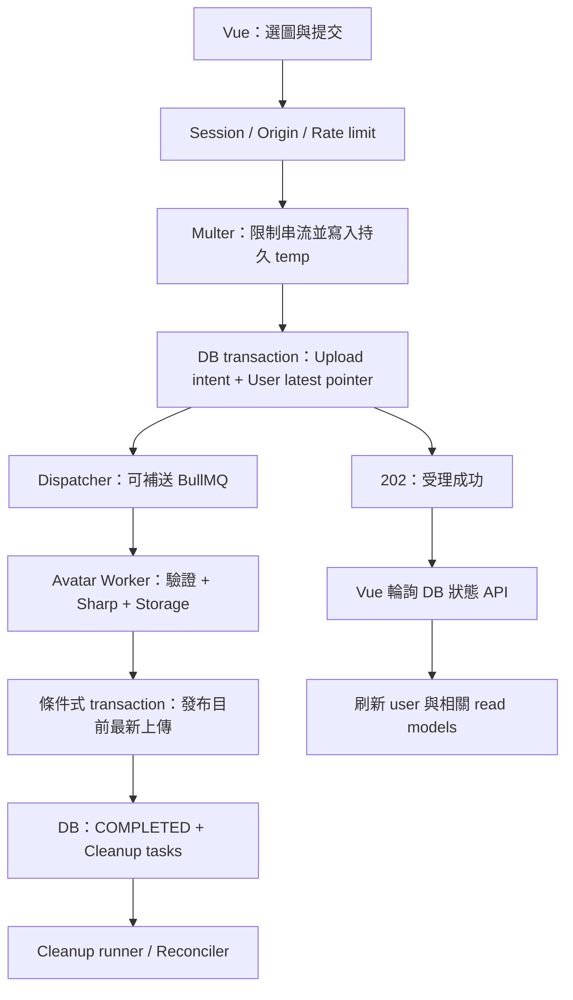

# Kanban Avatar 功能規格與實作計畫

日期：2026-09-28。狀態：**設計提案，尚未實作**。

本文件依使用者提供的「Kanban Avatar 圖片處理功能規格」及目前原始碼制定。此次只新增本文件，未修改程式、schema、migration、套件或既有文件，也未執行 build、測試或資料庫操作。文中的程式區塊都是未來實作的契約草案。

## 1. 專案目前進度

以原始碼為準，不能直接把 README 的歷史敘述當成目前實作，也不能把已有檔案當成已驗收。

| 領域 | 目前已具備 | 尚未完成／限制 | 原始碼依據 |
| --- | --- | --- | --- |
| 專案結構 | pnpm workspace；Vue 3／Pinia／TypeScript、NestJS、Prisma／PostgreSQL、Redis、共用 contracts | 並非只有 Markdown 的目錄，根目錄已有 Git、package scripts 與 CI | [根 package](../package.json)、[backend package](../backend/package.json)、[frontend package](../frontend/package.json) |
| 登入與 Session | 註冊、登入、登出、Redis Session、Cookie、rotation、userInfo、前端路由保護 | Google OAuth、忘記密碼尚未形成流程 | [AuthService](../backend/src/auth/auth.service.ts)、[SessionGuard](../backend/src/session/session.guard.ts)、[router](../frontend/src/router/index.ts) |
| 驗證信 | BullMQ 入列、獨立 Worker、Redis token、Nodemailer、驗證／重寄、冷卻及未驗證登入限制 | 驗證與重寄前端頁面尚未建立；Email queue 未配置明確 retry／backoff；Worker、Queue 等 scaffold tests 被 skip | [QueueService](../backend/src/queue/queue.service.ts)、[WorkerService](../backend/src/worker/worker.service.ts)、[Auth E2E](../backend/test/auth.e2e.spec.ts) |
| Workspace／Project | Workspace 建立／切換／成員；邀請接受／拒絕；Project 建立、成員、通知、個人 pin | 邀請取消、部分角色／成員管理、負向授權與併行測試仍有缺口 | [進度文件](progress.md)、[ProjectService](../backend/src/project/project.service.ts) |
| Board | 已有 BoardColumn schema、讀取與新增 API；前端實際載入 Columns | `getBoardColumn` 未檢查 membership；`moveColumn` 為 stub；Card 尚無 model，前端 cards 為空陣列；完整 snapshot／協作未完成 | [BoardService](../backend/src/board/board.service.ts)、[BoardController](../backend/src/board/board.controller.ts)、[ProjectView](../frontend/src/views/projectView/ProjectView.vue) |
| Socket.IO | Session handshake、user room、Workspace room、邀請與通知推播 | Board commands、ack、recovery、跨程序 Worker 通知橋接尚未建立；重連與 room lifecycle 仍需補強 | [SocketService](../backend/src/socket/socket.service.ts)、[Socket contracts](../packages/contracts/socket.ts) |
| Avatar | User 有 nullable `avatarUrl`；userInfo、Workspace／Project 成員與通知 read model 已帶 URL | 無上傳 API、processing record、Sharp、Storage provider；共用 Avatar 只顯示首字；UserMenu 設定項目 disabled | [schema](../backend/prisma/schema.prisma)、[UserRepository](../backend/src/user/user.repository.ts)、[Avatar](../frontend/src/components/shared/Avatar/Avatar.vue)、[UserMenu](../frontend/src/components/account/UserMenu/UserMenu.vue) |
| 測試與部署 | Backend Jest／Supertest、Frontend Vitest／VTU、隔離 PostgreSQL／Redis E2E runner、Backend CI | Playwright 仍為 Vue starter scaffold；Compose 只有資料服務；沒有已驗證的完整圖片部署環境 | [runner](../scripts/runBackend.e2e.mjs)、[CI](../.github/workflows/ci.yml)、[Playwright scaffold](../frontend/e2e/vue.spec.ts) |

歷史驗證：`docs/progress.md` 記載上一輪 Backend 169 tests passed／5 skipped、E2E 4 suites／13 tests passed、前後端型別檢查通過。**這不是本次重新驗證的結果**。目前服務是否正在執行、真實資料庫內容、SMTP／S3 是否可用：**【資料不足，無法確認】**。

結論：專案已具備新增 Avatar 的框架與非同步作業起點，但 Avatar 本身仍是「欄位與展示介面預留」。整個 Kanban 也尚未達到完整即時協作階段。不以主觀百分比表示完成度。

Board GET 授權缺口建議另案優先修正；本功能不順帶重構 Board、Auth 或 Email。

## 2. 可重用能力與必要調整

| 能力 | 結論 | Avatar 使用方式 |
| --- | --- | --- |
| Authentication | 可沿用 | `SessionGuard` 寫入的是 `req.userId`，不是 `req.user.id`；只有自己的 Avatar 可以變更 |
| Prisma | 可沿用 | `PrismaService` 使用 `PrismaPg`；沿用 Service／Repository 分工、`@map` snake_case、UUID、`Prisma.TransactionClient` |
| Config | 可沿用 | `config/env.ts` 的 Zod 驗證＋`ConfigService<Env>`，不散落讀取 `process.env` |
| API envelope | 可沿用 | Controller 回傳 `ApiResult<T>`，由 interceptor 轉為 `{code,data,message,time,error}`；失敗走 `AppException` |
| BullMQ | 沿用原生封裝模式 | 目前直接 `new Queue`／`new Worker`，不是 `@nestjs/bullmq`；新增 Avatar 專用 QueueService，不把圖片邏輯塞進 Email QueueService |
| Redis connection | 需局部改善生命週期 | 現行 `createBullMQConnection()` 回傳同一個 `mqRedisClient`，Queue／Worker 都會呼叫 destroy；新增 consumer 前需明確 owner／close 規則 |
| Logger | HTTP 已有 Pino，可重用設定 | 新 Avatar Worker application context 要註冊 LoggerModule 並接上 Pino；不可照搬目前 Email Worker 的 payload `console.log` |
| Rate limit | 可重用 Redis，不能直接沿用演算法 | 現行 email 為 `SET NX EX` 冷卻，不是每分鐘 5 次；Avatar 新增自己的原子計數／滑動視窗 |
| Storage／上傳 | 無既有服務 | 建立可替換的 TempStorage、Storage abstraction；新增 Multer 處理與 Sharp |
| Test utilities | 可沿用 | E2E runner、真實 DB／Redis、驗證測試帳號 helper、Auth E2E 啟動實際 Worker 的方式 |
| Frontend | 可沿用 | Axios `withCredentials`、Pinia、Reka Dialog、UserMenu、i18n、既有 token 與 Avatar 元件 |

依 [API contract](api-contract-plan.md)，公開資料不得包含內部 `User.id`／`userId`。因此 Job ID 與公開圖片 key 都不嵌入 userId。後端 payload、log、DB 關聯仍可使用內部 userId。

## 3. 範圍與本版決策

### 3.1 必須完成

- 登入使用者上傳、查詢進度、替換與刪除自己的 Avatar。
- JPEG／PNG／WebP；5 MiB；背景產生 64、128、256 正方形 WebP。
- BullMQ retry／backoff／progress、獨立 concurrency、獨立 Worker entry。
- 保留舊圖直到新圖完成；舊 job 不覆蓋新圖；DELETE 不會被執行中的 job 復活。
- HTTP 重送、重複執行、Redis／DB／Storage 部分失敗的恢復。
- Local Storage 第一版可直接驗收；S3 provider 可後續加入，但介面與部署限制本次定義。
- 前端完整狀態與輪詢、真實基礎設施測試、可重試 cleanup。

### 3.2 本版不納入

手動裁切器、GIF／APNG／動態 WebP、SVG、HEIC、原圖下載、歷史頭像還原、Google Avatar 匯入、Workspace／Project 封面、跨所有使用者即時廣播、一般用途 Media Asset 平台。

### 3.3 對原始規格的修正

| 原提案 | 本專案採用 | 原因 |
| --- | --- | --- |
| `/users/me/avatar` | `/user/me/avatar` | 沿用現有 `/user` namespace，不改既有 `/user/userInfo` |
| `avatar:{userId}:{uploadId}` | `avatar-<uploadId>` | 符合官方自訂 job ID 限制，避免公開 userId；jobId 只留後端 |
| User 上只有狀態 | User＋AvatarUpload＋AvatarAttempt＋StorageCleanupTask | 要能追蹤被取代的上傳、跨系統補償、重試與 cleanup，單一 User row 不足 |
| API 寫 DB 後直接 queue.add | DB durable intent＋dispatcher | PostgreSQL 與 Redis 無共同 transaction；避免已受理但未入列而永久卡住 |
| `tempFilePath` 放 job | payload 只放 userId／uploadId／版本；DB 保存 tempKey | 避免綁住 API 主機的絕對路徑 |
| 全部 retry 共用一組 key | 每次真正執行有持久化 attemptId；同 attempt 內 key 固定 | stalled job 可能有重疊執行，隔離舊 attempt 的寫入／刪除，避免刪到已發布圖片 |
| enqueue 時捕捉 oldAvatarKeys | publish transaction 內讀取當下有效 asset | 等待期間有效頭像可能已改變，payload 中舊快照會過時 |
| DB 更新 throw 就刪新圖 | 先確認 commit 結果；不明時延後補償 | 連線中斷不一定代表 DB rollback，不能刪除 DB 已引用的圖 |
| cleanup 失敗只 log | durable cleanup task＋排程重試＋orphan sweep | 才能達到不留下永久孤兒檔的驗收目標 |
| attempts 用盡才 FAILED | 可重試錯誤用盡才 FAILED；無法恢復的輸入錯誤立即 FAILED | `UnrecoverableError` 不會跑完 3 次 |

BullMQ 官方明確不允許自訂 ID 含 `:`，工作移除後同 ID 也可再次加入，所以不能把 Redis 的 jobId 當成永久冪等保證。[Job IDs](https://docs.bullmq.io/guide/jobs/job-ids)

本機 BullMQ 原始碼對部分三段式冒號 ID 有相容分支；本規格仍遵循官方公開限制，不依賴該內部例外。

## 4. 系統流程與責任



- API 處理基本驗證、有限大小的輸入 IO 與 DB 受理；不做 resize、WebP encode 或最終 Storage upload。
- AvatarService 處理上傳／刪除業務、冪等與交易，不直接散落 BullMQ API。
- AvatarRepository 封裝條件更新、交易、claim／fencing 與 read model。
- AvatarQueueService 只封裝 queue.add、job options、job 查詢及 queue lifecycle。
- Dispatcher 掃描 durable intent；AvatarWorker 接 job；AvatarProcessor 協調 workflow；ImageProcessingService 只處理圖片。
- Cleanup runner、Reconciler 屬於 Avatar domain 的背景服務，QueueEvents 僅提供觀測。

本版使用 PostgreSQL 記錄作為 outbox，不另外導入通用事件平台。

## 5. 資料模型

### 5.1 User 新欄位與保留欄位

保留既有 `avatarUrl` 供所有既有 read model 使用，新成功頭像將它設為 medium URL。不要新增與它重複的 `avatarMediumUrl` DB 欄位；API 的 `mediumUrl` 由它投影。

| 欄位 | Prisma 型別／預設 | 意義 |
| --- | --- | --- |
| avatarUrl | 既有 `String?` | 目前可顯示頭像；新資料為 128px URL |
| avatarSmallUrl | `String?` | 目前可顯示的 64px URL |
| avatarLargeUrl | `String?` | 目前可顯示的 256px URL |
| avatarStatus | `AvatarStatus @default(NONE)` | 最新操作狀態，與是否仍有舊圖分開 |
| avatarUploadId | `String? @db.Uuid` | 最新被 DB 受理的 upload；DELETE 設 null |
| avatarAssetAttemptId | `String? @db.Uuid` | 目前真正發布的 attempt；不能用 avatarUploadId 推導現圖 |
| avatarUpdatedAt | `DateTime?` | 發布／刪除成功時間；pending／progress 不改它 |
| avatarRevision | `Int @default(0)` | 受理、開始處理、發布、終止失敗、刪除等可見狀態變更遞增；供前端拒絕舊 response |
| avatarUploads | `AvatarUpload[]` | 所有上傳紀錄的 owner relation |

`AvatarStatus = NONE | PENDING | PROCESSING | COMPLETED | FAILED`。

`avatarUploadId`／`avatarAssetAttemptId` 是由 repository transaction 維護的 UUID pointer；第一版不建立雙向循環 FK。Upload → User、Attempt → Upload 則建立真正 FK，採 `onDelete: Restrict`，避免級聯刪除唯一能定位檔案的紀錄。未來硬刪帳號須先撤銷處理權並完成資產清理；本功能不新增帳號刪除 API。清理邏輯要查所有仍被引用的 pointer。

狀態不變量：

- `NONE`：沒有目前頭像、沒有當前上傳；所有 URL 和 pointer 為 null。
- `PENDING`／`PROCESSING`／`FAILED`：URL 可以仍是上一張成功頭像。
- `COMPLETED`：新系統中 URL 指向已發布 attempt；migration 保留的 legacy URL 是明確例外。
- 本次失敗不清空舊 URL，也不把其他較新 upload 標記 FAILED。

### 5.2 AvatarUpload（`avatar_uploads`）

| 欄位群組 | 欄位與型別 |
| --- | --- |
| 識別／owner | `id String @id @db.Uuid`、`userId String @db.Uuid`、User relation |
| HTTP 冪等 | `idempotencyKey String @db.VarChar(64)`、`requestSha256 String @db.Char(64)` |
| 輸入 | `tempKey String`、`tempProvider String`、`byteSize Int`、`declaredMime String`、`detectedFormat String?`、`width Int?`、`height Int?` |
| 固定轉換規則 | `pipelineVersion Int`、`webpQuality Int`；v1 尺寸固定由 pipelineVersion 定義 |
| 處理狀態 | `status AvatarUploadStatus @default(PENDING)`、`progress Int @default(0)`、`stage String`、`statusVersion Int @default(0)`、`failureCode String?`、`skipReason String?` |
| 重試與 owner fence | `executionCount Int @default(0)`、`activeAttemptId String? @db.Uuid`、`leaseExpiresAt DateTime?`、`lastHeartbeatAt DateTime?`、`nextAttemptAt DateTime?` |
| 入列補償 | `enqueuedAt DateTime?`、`nextDispatchAt DateTime`、`dispatchAttempts Int @default(0)`、`dispatchLeaseToken String? @db.Uuid`、`dispatchLeaseUntil DateTime?` |
| 時間 | `createdAt @default(now())`、`updatedAt @updatedAt`、`startedAt DateTime?`、`completedAt DateTime?`、`deadlineAt DateTime` |

`AvatarUploadStatus = PENDING | PROCESSING | COMPLETED | FAILED | SKIPPED`。`SKIPPED` 是個別上傳的終態，不加入 User 的 AvatarStatus。

約束：`@@unique([userId, idempotencyKey])`；索引 `[status,nextDispatchAt]`、`[status,leaseExpiresAt]`、`[userId,createdAt]`、`[deadlineAt]`。Migration 加入 `progress BETWEEN 0 AND 100`、非負次數、合法 quality 的 CHECK。

uploadId 由 server `randomUUID()` 產生。Client 的 Idempotency-Key 不是 uploadId，也不是 storage path。

### 5.3 AvatarAttempt（`avatar_attempts`）

| 欄位 | 意義 |
| --- | --- |
| `id UUID`、`uploadId UUID`、`number Int` | 一次取得處理權的 execution；`unique(uploadId,number)` |
| `status` | `ACTIVE / ABANDONED / PUBLISHED / RETIRED / CLEANED`；RETIRED 表示已永久禁止再發布 |
| `storageProvider`、`smallKey`、`mediumKey`、`largeKey` | 在任何 upload 前先保存全部預定 keys；provider 是穩定設定代號，不是 secret |
| `createdAt`、`finishedAt?`、`retiredAt?` | audit 與 orphan sweep 依據 |

不能只記錄已成功回應的 PUT：網路 timeout 後，遠端 object 可能其實已建立。因此所有預定 keys 都需要能被補償。

User `avatarAssetAttemptId` 指向目前資產；Upload `activeAttemptId` 指向目前具有寫入權的 execution；兩者不可混用。

### 5.4 StorageCleanupTask（`storage_cleanup_tasks`）

欄位：`id UUID`、`dedupeKey String @unique`、`targetType TEMP | ATTEMPT`、`targetId UUID`、`provider String`、`keys String[]`、`status PENDING | RUNNING | COMPLETED`、`attempts Int`、`nextRunAt DateTime`、`leaseToken UUID?`、`leaseExpiresAt DateTime?`、`lastErrorCode String?`、`createdAt`、`completedAt?`。

索引 `[status,nextRunAt]`、`[status,leaseExpiresAt]`。清理失敗不永久放棄；超過告警門檻降低頻率並持續補償。Completed task、attempt、upload 的刪除順序要遵守保留策略，不能先刪唯一能定位孤兒檔的 metadata。

### 5.5 Migration 與舊資料

新增 migration，名稱建議 `add_avatar_processing`，不改寫既有 migrations。

1. 建立 enums、三張新表、索引／CHECK，並增加 User nullable 欄位與預設值。
2. 舊 `avatarUrl IS NULL` 初始化 `NONE`；非 null 初始化 `COMPLETED`，保留原 URL，其他 size／attempt pointer 為 null。
3. Legacy 的 `avatarUpdatedAt` 保持 null，不捏造歷史時間。API small／large 可為 null，前端回退到 avatarUrl。
4. 不從外部／legacy URL 解析 path 去刪檔；只有 DB 管理的 keys 可以刪除。
5. 在空 DB 與含 legacy URL 的 DB 驗證；先 migration、再啟動新 API／Worker。回滾應停用新入口與 Worker，保留資料表和清理能力，不自動 drop 圖片紀錄。

## 6. HTTP 與共享 contracts

### 6.1 共通原則

- 路由 `/user/me/avatar`，沒有 `/api` 全域前綴。
- `SessionGuard` → Origin 檢查 → rate limit → multipart parsing；拒絕者不能先寫入完整檔案。
- 只接受 server 產生的 owner／key；multipart 不接受 userId、path、URL 或 crop options。
- 新增 `packages/contracts/avatar.ts` 與 exports；frontend 與 backend 共用 public types／runtime enum。
- `PublicUser` 保留目前三個欄位相容性。詳細進度從 Avatar API 取得，避免把 internal processing record 混入其他人的 read model。
- status API 回應 `Cache-Control: no-store`。錯誤 envelope 仍經目前 filter。

```ts
interface AvatarImageSet {
  url: string | null;       // compatibility / medium
  smallUrl: string | null;
  mediumUrl: string | null;
  largeUrl: string | null;
  updatedAt: string | null; // UTC ISO 8601
}

interface AvatarStatusData {
  status: AvatarStatus;     // User 最新操作狀態
  revision: number;
  upload: {
    uploadId: string;
    status: AvatarUploadStatus;
    version: number;
    progress: number;      // 0..100
    stage: AvatarStage;
    failureCode: AvatarFailureCode | null;
    updatedAt: string;
  } | null;
  avatar: AvatarImageSet;  // 現在顯示的圖，可能屬於上一個 upload
  pollAfterMs: number | null;
}
```

`AvatarStage` 固定 whitelist：`QUEUED / VALIDATING / TRANSFORMING / UPLOADING / PUBLISHING / RETRY_WAIT / DONE / FAILED / SKIPPED`，不回傳任意 library error 字串。

### 6.2 POST /user/me/avatar

`multipart/form-data`，只允許一個 `avatar` 檔案；必填 `Idempotency-Key: <client UUID>`。

- 檔案上限 **5,242,880 bytes（5 MiB）**，UI 同時標示「5 MiB」避免 MB 解讀不同。
- filename 不參與 path，也不需要進 DB／job。Declared MIME 僅允許 `image/jpeg`、`image/png`、`image/webp`；真實內容由 Worker 再驗證。
- 新 request 在 temp 持久化與 DB transaction commit 後回 `202 Accepted`，`Location: /user/me/avatar/status?uploadId=<id>`。
- 202 表示已可靠受理，可能尚未入 Redis；不宣稱圖片完成或已經開始處理。
- 新接受回應 `ApiResponse<AvatarUploadReceipt>`，data 為 `{ uploadId, status: "PENDING", statusUrl, replayed: false }`，外層 `code=1`。
- 同 key、同 SHA-256：`200 OK` 回同一 upload 的 receipt 與當下 status、`replayed:true`。不再次設 User latest、不再建立 job。若它已被取代，回 `SKIPPED` 或原本終態，不能重新啟動舊要求。
- 同 key、不同檔案內容：`409`。本版 request fingerprint 為原始檔 SHA-256；filename／declared MIME 不影響相同 bytes 的 replay，但基本 allowlist 仍先驗證。
- HTTP response 遺失／10 秒 timeout：同 key 重送；不要自動換 key。使用者明確選擇新檔或按「重新處理」才建立新 key。

冪等支援期限至少 7 天，upload row 在期限內不可刪除。超過保留期限的 key 可能成為新操作，Client 不重用舊 key。沒有永久全域內容去重，相同圖片使用新 key 仍算新上傳。

### 6.3 GET /user/me/avatar/status

- 無 query：回目前 User 狀態與最新 upload（沒有則 null）。
- 可選 `uploadId` UUID：回目前 `AvatarStatusData`，另加 `requestedUpload`（與 upload 同形＋`isCurrent`），用來確認早先 request 的最終結果。
- requestedUpload 必須屬於 `req.userId`；別人的 ID 與不存在的 ID 都回 `404 / ResourceNotFound`。
- 不讀 BullMQ 作為 public status 的唯一來源；Redis 工作清掉後仍能查 DB。
- 個別 job `FAILED` 是 `200` 的業務查詢結果，不是 GET HTTP 500。
- 查詢本身套用獨立上限（預設每 user 60 次／分鐘）；與 upload 的 5 次限額分開。

處理中的例子（此時可以仍顯示舊圖）：

```json
{
  "code": 1,
  "data": {
    "status": "PROCESSING",
    "revision": 8,
    "upload": {
      "uploadId": "8cdc38a1-28a0-48c6-b9da-b8c8f5c9158e",
      "status": "PROCESSING",
      "version": 3,
      "progress": 60,
      "stage": "UPLOADING",
      "failureCode": null,
      "updatedAt": "2026-09-28T03:00:00.000Z"
    },
    "avatar": {
      "url": "https://media.example.test/avatars/previous-upload/previous-attempt/medium.webp",
      "smallUrl": null,
      "mediumUrl": "https://media.example.test/avatars/previous-upload/previous-attempt/medium.webp",
      "largeUrl": null,
      "updatedAt": "2026-09-27T03:00:00.000Z"
    },
    "pollAfterMs": 2000
  },
  "message": "請求成功",
  "time": "2026-09-28T03:00:00.000Z",
  "error": null
}
```

### 6.4 DELETE /user/me/avatar

- 登入且通過 Origin 檢查；冪等 DELETE，不需要另建 idempotency record。
- 鎖住 User row，在 transaction 中清空全部 URL／兩個 pointer、設 `NONE`、更新 avatarUpdatedAt／revision。
- 將當時尚在 PENDING／PROCESSING 的最新 upload 設 SKIPPED，reason=`USER_REMOVED`，撤銷 activeAttemptId；同交易建立目前資產及輸入清理任務。
- transaction commit 後回 `200` 與新的 `AvatarStatusData`；物件刪除採 eventual cleanup。
- 已是完全空狀態時回原狀態，不必每次遞增 revision。
- DELETE 不依賴能否移除 BullMQ active job。執行中的 Worker 必須被 DB fence 擋下。
- DELETE 與上傳以 User row transaction 順序決定先後：先刪除、後受理的 upload 可以成功；先受理、後刪除的 upload 不得復活。

### 6.5 HTTP 錯誤契約

新增 Avatar domain ApiCode，建議保留 `6001..6010`，實作前確認尚未占用。

| HTTP | ApiCode（建議數值） | 情況 |
| --- | --- | --- |
| 400 | ValidationError（既有 1000） | 缺 avatar、多檔、未知 field、缺／非法 Idempotency-Key、無效 query UUID |
| 401 | Unauthenticated（既有 2003） | Session 不存在／失效 |
| 403 | AvatarOriginRejected（6001） | Origin 缺失、null 或不在允許清單 |
| 404 | ResourceNotFound（既有 3001） | 找不到自己可查詢的 upload |
| 409 | AvatarIdempotencyConflict（6002） | 同 key 對應不同 bytes |
| 413 | AvatarFileTooLarge（6003） | 檔案超過 5 MiB；包括串流中途超限 |
| 415 | AvatarUnsupportedMediaType（6004） | 不支援的 declared MIME／request content type |
| 429 | AvatarRateLimited（6005） | 上傳／刪除／status 各自限額；data 含 retryAfterSeconds，並回 Retry-After |
| 503 | AvatarTemporarilyUnavailable（6006） | temp 不可寫、受理前 DB 不可用、rate-limit Redis 不可用、容量上限 |
| 500 | InternalError（既有 5000） | 未分類錯誤；不回傳 stack／path／provider secret |

Multer 的大小、unexpected field、malformed multipart 必須轉為上述 AppException，不能全部落成 generic 500 或無法分流的 RequestError。DTO validation pipe 不會自動驗證 multipart 檔案。

Worker 發現假圖片時，POST 可能已回 202；此後 status 回 `FAILED / INVALID_IMAGE`。這與 API 的 declared MIME 415 是不同層次的驗證。

## 7. 受理、HTTP 冪等與可靠入列

### 7.1 API 受理演算法

1. 驗證 Session／Origin／key 格式／rate limit，限制 body streaming。
2. 以 server UUID 寫入 temp `.part`，同步計算 SHA-256；接收結束才 atomic rename 成 ready object。中斷時刪 `.part`，sweeper 作保險。
3. 開啟短 DB transaction，鎖 User row；若 owner 不存在，清理此次輸入並回 401。
4. 在 owner＋key 唯一約束下檢查 replay／conflict。Replay 使用原 record，刪掉此次重傳產生的 temp。
5. 新 key：建立 AvatarUpload PENDING、deadline／pipeline config snapshot；舊的未完成 upload 標 SKIPPED／SUPERSEDED 並撤銷 fence、安排安全清理。
6. User latest upload pointer 改為新 ID，avatarStatus=PENDING，revision 遞增；原成功圖片完全保留。
7. commit 後回 202。Dispatcher 下一個週期入列，可發出程序內 wake-up 提升速度，但 correctness 不依賴 wake-up。

兩個請求同時送達，以取得 User row lock 並 commit 的順序定義「最新」，不依賴 UUID 排序、瀏覽器開始時間或圖片完成時間。

DB 受理 throw 若可能為不明 commit：先用 userId＋idempotencyKey 查回。已存在且 hash 相符則視為已受理；無法確認時保留 temp，回可重試錯誤，待相同 key 重送或 reconciler 查核。不可立即刪可能已被 DB 引用的 input。

### 7.2 Dispatcher

- 每 2 秒掃到期的 PENDING intents；每批最多 50 筆，以 DB lease/CAS claim。多個 Worker instance 不能只靠 Nest cron 的本機互斥。
- transaction 中 claim，transaction 外 queue.add，成功後標 enqueuedAt；不可在 DB transaction 裡等待 Redis。
- Queue=`avatar-processing`、Job=`process-user-avatar`、jobId=`avatar-<uploadId>`。
- payload：`{ schemaVersion: 1, userId, uploadId }`；temp、output keys、品質等從持久紀錄取得。Payload 不包含 buffer、base64、Session、原始 filename、oldAvatarKeys。Worker 入口以 runtime schema 驗證 payload、job name 與版本，並確認 upload 的 DB owner 與 payload 相符，不把 queue 資料當成無條件可信的授權來源。
- queue.add 失敗：保持 PENDING，更新 dispatchAttempts／nextDispatchAt，記 log 並告警；不把它當圖片失敗。API 已成功受理，無須使用者重新上傳。
- add 成功但 enqueuedAt 寫失敗：同 jobId 補送；DB 終態與 Worker claim 仍可防重。
- enqueuedAt 不是永久真相。Reconciler 需偵測非終態 row 的 job 是否遺失；Redis 資料恢復後補送，不能只掃 enqueuedAt=null。
- 既有 job failed／completed 但 DB 非終態：先做狀態調和，不對同 ID 盲目 queue.add；只在確認無 active owner 後 retry／移除已終態 job 再補送。持久 executionCount 不重置。

PostgreSQL 與 Redis 無法 exactly-once；本版保證「至少一次派送＋最多一次有效發布＋可補償副作用」。

## 8. Worker、競速與重複執行

### 8.1 Queue 設定

- `attempts: 3`：正常失敗情況總共最多三次執行，不是初次外加三次。
- `backoff: { type: 'exponential', delay: 2000 }`，兩次間隔約 2 秒、4 秒，尚有 queue wait。
- `concurrency: AVATAR_WORKER_CONCURRENCY`，預設 3；與 Email Worker 分開。
- completed job 保留 24 小時／最多 1000；failed 保留 7 天／最多 5000。DB idempotency 不依賴這些 Redis 保留時間。
- stalled recovery 啟用有限重試（例如 maxStalledCount=1），必須驗證目前安裝版本的行為；DB executionCount 同時設上限 3，避免 Redis job 重建繞過執行上限。

BullMQ attempts／backoff 的語意依 [Retrying failing jobs](https://docs.bullmq.io/guide/retrying-failing-jobs)。不可恢復的錯誤透過 [UnrecoverableError](https://docs.bullmq.io/patterns/stop-retrying-jobs) 提前終止。

### 8.2 Claim 與 fence

1. 先檢查 upload 是否已 COMPLETED／FAILED／SKIPPED。已終態就回傳已有結果，不再處理圖片、不將 COMPLETED 改回 PROCESSING。
2. 在短 transaction 依固定順序鎖 **User → AvatarUpload → AvatarAttempt**；User 不存在或不再指向這個 upload，就標 SKIPPED 並補清理。
3. 檢查 DB lease。若仍有有效 execution，重複投遞不另啟動 Sharp；透過延後作業機制再檢查，不能把業務直接標成功。此等待不得消耗 processing 次數。
4. 無有效 lease 時，先檢查既有 executionCount 是否已達 3；若未達則增加一次，建立新的 AvatarAttempt 及全部 keys、更新 activeAttemptId／leaseExpiresAt，狀態改 PROCESSING。第三次仍可執行，第四次 claim 才被拒絕。
5. 預設 DB lease 120 秒、heartbeat 30 秒；使用 DB 時間。Heartbeat、progress、失敗、發布全部必須 `WHERE activeAttemptId = thisAttempt AND status = PROCESSING`，且有效 lease／User latest pointer 符合。
6. lease 失效後舊 Worker 不得自行恢復 owner；若需要重跑，必須重新 claim，取得新 attemptId。各 provider IO 使用有限 timeout，失去 owner 後停止後續副作用。

DB fence 是業務正確性的依據；BullMQ lock 用於 queue 調度。二者不能互相取代。

### 8.3 圖片工作流程

1. 讀取 temp stream，檢查仍存在、大小／SHA-256 與 record 相符。
2. Sharp metadata 驗證真實格式、尺寸、像素量與動態頁數；完整 decode／encode 才算通過圖片處理。
3. EXIF 自動轉正、中心裁切、產生三種 WebP；先全部成功產生，才開始輸出 upload。
4. 逐張 upload 到本 attempt 的三個固定 keys；在成功回應中驗證 size／content type，必要時 stat。不能只用 exists 當作內容完整性的證明。
5. 再開短 DB transaction，重新取得 User／Upload lock 並驗證 latest pointer、activeAttemptId、有效 lease、非終態；所有條件都必須成立。
6. 讀取當下的 `avatarAssetAttemptId` 作為真正舊資產。更新 User 三個 URL、asset pointer、status、時間／revision；Upload COMPLETED／progress=100、Attempt PUBLISHED，在同交易建立舊圖與 temp cleanup tasks。
7. commit 後回傳成功。更新 BullMQ progress=100 或完成 acknowledgement 若失敗，下次 delivery 從 DB 終態返回成功，不再轉檔。

### 8.4 為何 output key 含 attemptId

```text
avatars/<uploadId>/<attemptId>/small.webp
avatars/<uploadId>/<attemptId>/medium.webp
avatars/<uploadId>/<attemptId>/large.webp
```

同 attempt 的 provider retry 覆蓋相同 key；新的 processing execution 先建立持久 attempt 再使用新 namespace。不能在每個 PUT retry 任意產生 filename。

這比原規格多一層，是為了處理 Worker A stalled、Worker B 接手後，A 又恢復的情況：A 的 cleanup／晚到 PUT 只影響 A 的 namespace，不會覆寫或刪除 B 已發布的圖。DB 上限、cleanup tasks 與 sweeper 限制重試資產累積。

### 8.5 必須成立的競速結果

| 競速 | 最終結果 |
| --- | --- |
| A 後完成、B 已是最新 | A SKIPPED；只有 B 可發布；A 只清自己的未發布 attempt |
| B 受理但處理失敗 | 顯示上一張成功圖；不讓被取代的 A 補上；最新狀態 FAILED |
| 同 upload 重複 delivery | 已 COMPLETED 直接返回；處理中只有持有 DB fence 的 attempt 可更新 |
| DELETE 在處理途中 commit | pointer=null、status=NONE；任何舊 attempt 不得復活頭像 |
| A 先發布、B 隨後發布 | B 在 publish transaction 取得 A 當舊圖並安排清理，不使用 B 入列時的舊快照 |
| 同 job 的舊 attempt 恢復 | 無權更新進度、失敗或 User；僅能處理自己的 namespace |
| 原子條件 UPDATE 影響 0 筆 | 視為失去處理權／過期，不得 fallback 無條件更新 |

單純「先 SELECT 比對 uploadId，之後無條件 UPDATE」有 TOCTOU；即使包在 transaction 裡也不自動安全。實作必須使用 row lock＋條件寫入，並對 PostgreSQL 實測。

## 9. ImageProcessingService

介面建議 `process(input, pipelineConfig): Promise<{ metadata, variants }>`。variants 僅含 small／medium／large 的 buffer 或可讀 stream、bytes、contentType；不呼叫 Prisma 或 AWS SDK。

| 項目 | v1 決策 |
| --- | --- |
| Input bytes | 1..5,242,880 |
| 真實格式 | jpeg、png、webp；Declared MIME 與真實格式不符時拒絕 |
| 寬／高 | 各 1..8000 |
| 總像素 | <= 16,000,000；比只設 8000×8000 更保守 |
| 動態圖片 | 拒絕；pages > 1 或偵測為 APNG／animated WebP 即 FAILED；不能默默只取第一頁 |
| 方向 | 先 auto-orient，再 crop；包含手機 EXIF 旋轉測例 |
| Resize | 64×64、128×128、256×256；fit=cover、position=centre；維持比例 |
| 小圖 | 允許等比例放大以保證固定輸出尺寸，UI 不保證提升原圖清晰度 |
| 編碼 | WebP quality=80、固定 pipelineVersion；保留 alpha；輸出 sRGB；不保留 EXIF／GPS／原 filename |
| 資源 | constructor 設 limitInputPixels；禁止 unlimited；尺寸檢查在輸出轉檔前；每 job 串行處理三尺寸作為初始記憶體策略 |

Sharp constructor 的 pixel／page 選項見 [Constructor](https://sharp.pixelplumbing.com/api-constructor/)；方向與 metadata 行為見 [Image operations](https://sharp.pixelplumbing.com/api-operation/) 與 [Output options](https://sharp.pixelplumbing.com/api-output/)。以上數值、動態格式拒絕與品質是本專案設計決策，不是套件預設值。

測試需使用真實 Sharp。宣告 MIME／metadata 可解析不代表完整檔案可解碼。Sharp 版本升級不可讓同一 upload 的 retry 使用不同 pipeline 規則；record 保存品質與版本，舊版本至少保留到在途工作清空。

## 10. Storage 與 TempStorage

### 10.1 StorageService 抽象

```ts
interface StorageService {
  upload(input: {
    key: string;
    body: Buffer | NodeJS.ReadableStream;
    contentType: 'image/webp';
    cacheControl: string;
  }): Promise<{ key: string; byteSize: number }>;
  delete(key: string): Promise<void>;
  exists(key: string): Promise<boolean>;
  stat(key: string): Promise<{ byteSize: number; contentType: string } | null>;
  getPublicUrl(key: string): string;
  listManagedObjects(input: {
    prefix: string;
    cursor?: string;
  }): Promise<{ objects: { key: string; updatedAt: Date }[]; nextCursor?: string }>;
}
```

以 Nest injection token 注入 LocalStorageService／S3StorageService。`delete` 遇到不存在視為成功；其餘權限、連線錯誤不得吞掉。Keys 僅來自 DB／server generator，禁止 URL 反解析刪除。

Local upload 使用同檔案系統的 `.part`＋rename，避免公開半份檔案；resolve 後確認位於設定 root，拒絕 `..`、absolute path、symlink 越界。公開 URL 使用 `/media/avatars/…`，只提供最終 WebP。以受限 static middleware 提供 binary response，不經 JSON WrapResponseInterceptor；拒絕 `.part`／dotfiles，不能把整個 storage root 直接公開。

S3 adapter 使用 PutObject／DeleteObject／HeadObject／ListObjectsV2；設定 region、bucket、endpoint、path style 與 public base URL；credentials 使用環境／IAM provider chain，不入 job。Public URL 不保存短期 presigned URL；bucket 保持禁止列舉，透過受控 media origin／CDN 讀取。採 private bucket＋CDN 時須另驗證 origin access policy。

### 10.2 TempStorageService

能力：`write(stream)`、`openRead(tempKey)`、`stat(tempKey)`、`delete(tempKey)`、分頁列舉 expired candidates。存放 server UUID，不使用原 filename。

- v1 使用 **持久的 shared filesystem temp root**，與公開 media root 分離。API／Worker 必須看得到同一 temp namespace。
- 同機獨立 Node process 可共用絕對 root；分開 container 要掛同一 persistent volume；不同主機若沒有 shared filesystem，此部署不被支援。
- 不可用 container ephemeral `/tmp` 當唯一重試輸入，也不可把 API 的任意 absolute path 傳給 Worker。
- S3 最終 output 可以先上線，但若 API／Worker 跨主機仍需 shared temp。未來改 object temp 時，API streaming temp upload 是必要 IO，須明確調整「API 不上傳 Storage」的字面限制，或另設 direct-upload／finalize API；不假装能完全沒有輸入儲存 IO。

### 10.3 公開內容與 cache

本版將 Avatar 視為知道 URL 即可讀取的公開個人圖像，不承諾私人檔案權限。temp 永不公開，output 僅公開 WebP，回 `Content-Type: image/webp`、`X-Content-Type-Options: nosniff`，停用 directory listing。

版本 URL 不覆寫已發布內容，預設 `Cache-Control: public, max-age=86400, immutable`。替換立即使用新 URL；舊 origin 檔最早延後 24 小時清理，減少舊頁面快取破圖。DELETE 立即移除應用程式引用，但瀏覽器／CDN 已快取圖片可能留到 TTL；需要立即全球撤銷時，另納入 CDN purge 或 private serving，不能以刪 S3 object 宣稱全部快取消失。

## 11. 重試、補償與終態

### 11.1 錯誤分類

| 類型 | 處理 |
| --- | --- |
| 假圖／損壞、格式不符、尺寸／像素超限、動畫 | 立即記錄 FAILED＋safe failureCode，保留舊圖，安排 temp／attempt 清理，throw UnrecoverableError |
| User 消失／新上傳取代／使用者刪除 | SKIPPED；不重試，不回寫 User FAILED |
| 永久缺失的 temp／hash 不符 | FAILED／INPUT_MISSING 或 INPUT_MISMATCH；儲存服務暫時讀取失敗則仍可 retry |
| Storage timeout／網路、DB transient、Redis 短暫中斷 | 有限 retry，保留原 temp；更新 stage=RETRY_WAIT，不提前標 FAILED |
| Storage 403／錯誤 bucket／不支援 pipeline | 設定錯誤，停止無效重試並告警；public failureCode=PROCESSING_UNAVAILABLE，不暴露服務細節 |
| stale lease／舊 attempt | 停止後續寫入；不得更新 User／Upload 的最新狀態 |
| 3 次執行用盡 | 若仍為最新且非終態，FAILED／PROCESSING_RETRY_EXHAUSTED；原圖清理排程化 |
| 到達 24 小時 deadline | 在 DB 撤銷 fence 後 FAILED／PROCESSING_EXPIRED；不是任意依檔案 mtime 刪掉仍可重試的 input |

Public failure codes 全部由 contracts whitelist 定義。内部 lastErrorCode／log 可以更細，但不包含 raw stack、使用者檔名或 storage credential。

### 11.2 部分成功與 commit 不明

| 失敗位置 | 必要補償 |
| --- | --- |
| API temp ready 前 | 清本次 `.part`；掃描器補漏 |
| Temp ready，DB 未受理 | 確認沒被引用後清 temp；commit 不明先查相同 idempotency record |
| DB 受理，queue.add 失敗 | durable intent 補送；保留 input |
| 只有部分 output upload 成功 | 本 attempt 永久撤销發布權，三個預定 keys 都加入 cleanup；input 保留供 retry |
| 三張已寫入，DB 明確 rollback | 若 attempt 仍未發布，撤銷後安排三個 keys 清理，再 retry |
| publish 呼叫 throw，commit 結果不明 | 重新讀 DB：已發布則成功；未發布則以 transaction 撤銷後補償；DB 仍不可用時暫留 output，交 reconciler，絕不先刪 |
| DB 成功，queue ack／progress 失敗 | 回頭以 DB COMPLETED 判定成功，不能變 FAILED 或重做 output |
| 舊圖／temp delete 失敗 | 新頭像維持 COMPLETED；cleanup task 保留重試與告警 |

Worker catch/finally 不能無條件 delete temp，也不能把「執行中的自己的產物」直接當作「一定未發布的垃圾」。

### 11.3 Cleanup runner 與 orphan sweep

- 成功／終止／SKIPPED／DELETE 在 DB transaction 內寫入 cleanup intent。清理用背景 DB poller 即可，第一版不增加第二個 BullMQ queue。
- 每分鐘 claim 到期 task，以 lease／token 防多 instance 重複更新。重複 delete 本身安全，不能因執行兩次而刪別的版本。
- 刪 attempt 前，以 transaction 鎖同樣順序，確認不存在 User asset pointer 引用，且該 attempt 已 RETIRED／ABANDONED、無再次發布資格；再於 transaction 外 delete。仍被引用者不刪。
- 針對被放棄但可能仍有晚到 PUT 的 attempt，先撤銷 fence，至少等待 lease／最大 IO timeout 的安全窗口；sweeper 反覆比對退休 namespace，晚到物件仍可回收。
- temp 在成功、終止失敗、SKIPPED 後清；仍有有效 execution 的 temp 延後至 lease／IO 安全窗口後。中間 retry 不刪。
- 每小時分頁掃 managed temp／output：只刪 DB 確認無引用且超過安全窗口的 objects；DB 查核失敗時完全不刪。未知 temp `.part` 預設 1 小時、未知 ready input／output 24 小時後才成為候選。
- 既有外部 URL 不在 managed namespace，永不掃描／刪除。
- 業務終態與 cleanup 終態分開。對外 100% 代表圖片已發布，不必等待舊檔 physical delete。
- 終態 upload／attempt 只在 idempotency 保留期已過、非現行資產、cleanup 完成且無 active lease 後刪。持續被 User 引用的 asset metadata 永不按一般 TTL 刪除。

「不留下永久孤兒檔」以 DB／Storage 恢復可用且背景服務持續運作為前提；持續故障必須有 backlog 告警，不能宣稱無條件保證。

### 11.4 Reconciler

每分鐘處理逾時非終態紀錄：job 遺失、worker crash、DB lease 過期、failed job 未能落 DB、deadline 超時。

重試前撤銷過期 attempt fence、建立 cleanup intent；尚有 processing 次數與 deadline 才補送。已 COMPLETED 的 DB record 永不被 Redis failed 事件改回 FAILED。QueueEvents 可以觸發提醒，但 domain reconciler 即使錯過所有事件也必須恢復狀態。

## 12. Progress 與觀測

| DB progress | stage | 含義 |
| --- | --- | --- |
| 0 | QUEUED | 已受理，等待 dispatcher／worker |
| 10 | VALIDATING | execution 已 claim |
| 20 | TRANSFORMING | 圖片驗證完成 |
| 40 | TRANSFORMING | 已完成第一種輸出 |
| 60 | UPLOADING | 三種 WebP 全部完成 |
| 80 | PUBLISHING | 所有最終 objects 已存妥 |
| 100 | DONE | User＋Upload publish transaction 已 commit |

Sharp resize 與 encode 同一 pipeline 執行，不將尚未真正執行的 lazy resize 誤報為完成。原規格的 DB update=90 改為原子發布=100；cleanup 另有內部狀態。

每個里程碑先條件式寫 DB（statusVersion 遞增），再 best-effort `job.updateProgress`。同 upload progress 使用 max 與既有值比較，retry 可停在 60 並 stage=RETRY_WAIT，不假裝進度持續前進；只有 COMPLETED 為 100。GET 不承諾每秒連續變動或精確剩餘時間。

Structured log：event、jobId、uploadId、userId（僅後端）、attemptId、executionCount、stage、durationMs、safe errorCode、cleanupTaskId。不得 log 檔案 bytes／base64、Cookie、token、完整 job data 或原始 filename。

至少觀測 pending age、processing duration、成功／失敗／SKIPPED、retry／stalled、cleanup backlog／oldest age、temp bytes、worker RSS。API 的「受理成功」與「processing 成功」分開計數。

## 13. Redis 與獨立部署

### 13.1 連線生命週期

目前的共享 `mqRedisClient` 不應隨新增第二個 queue 被多個 provider 任意 quit。

目標採用「RedisService factory 建立連線，consumer 明確擁有該連線」：

- Session／rate limit 沿用 app Redis client。
- Avatar Queue producer、Worker、QueueEvents 各自取得具名專用 BullMQ connection；底層沿用本專案 `createNodeRedisClient(createClient(...))`。
- owner 先 close QueueEvents／Worker／Queue，再關自己持有的 connection；重複 close 安全；不影響 Email／Session。
- 對 factory 的局部調整及 Email 既有 owner 呼叫必須一起測試，不能只新增 provider 卻留下全域 destroy 行為。
- API producer 採有限等待；Worker 可重連。實作以本機 BullMQ 6 型別為準，不直接複製只適用 ioredis 的選項。

### 13.2 Process 與 shutdown

保留既有 Email `worker/main.ts`；另加 `worker/avatar.main.ts` 與專用 module，只啟動 Avatar worker、dispatcher、cleanup、reconciler，import Prisma／Redis／Config／Storage／Logger，不 import HTTP AppModule。

API 只註冊接收端與 storage serving，不啟動 Avatar processor。開發預期三個 app process：frontend、backend API、avatar worker；驗證信需要時另啟動原本 email worker。

Shutdown：先停止 scheduler claims，再停止拿新 job、讓 in-flight 有限時間完成、close Worker／QueueEvents／Queue，最後關 Redis／Prisma。process 被強制終止由 lease＋reconciler 恢復，不能靠 finally 保證收尾。

每 process concurrency=3 是初始值；兩個 replicas 就可能 6 個並行。Sharp threads、CPU／RSS 與 temp 容量需在部署前實測，必要時降低至 1。總量限制與等待數上限要在擴容前配置。

## 14. Config 建議值

| 設定 | 預設／驗證 |
| --- | --- |
| AVATAR_MAX_FILE_BYTES | 5242880，正整數 |
| AVATAR_MAX_WIDTH／HEIGHT | 各 8000 |
| AVATAR_MAX_PIXELS | 16000000 |
| AVATAR_WEBP_QUALITY | 80，1..100 |
| AVATAR_WORKER_CONCURRENCY | 3，正整數、初始上限 8 |
| AVATAR_JOB_ATTEMPTS | 3，正整數；DB execution cap 相同 |
| AVATAR_RETRY_DELAY_MS | 2000 |
| AVATAR_PIPELINE_VERSION | 1，允許版本 whitelist |
| AVATAR_PROCESSING_DEADLINE_HOURS | 24 |
| AVATAR_LEASE_SECONDS／HEARTBEAT_SECONDS | 120／30；驗證 heartbeat 小於 lease 的 1/2 |
| AVATAR_IO_TIMEOUT_MS | 30000，不能無限等待 |
| AVATAR_DISPATCH_INTERVAL_MS | 2000 |
| AVATAR_RECONCILE_INTERVAL_SECONDS | 60 |
| AVATAR_UPLOAD_LIMIT／WINDOW_SECONDS | 5／60，滑動視窗 |
| AVATAR_DELETE_LIMIT／STATUS_LIMIT | 每分鐘 10／60，與 upload 分開 |
| AVATAR_IDEMPOTENCY_RETENTION_DAYS | 7 |
| AVATAR_OLD_ASSET_GRACE_HOURS | 24 |
| AVATAR_STORAGE_DRIVER | local／s3，預設 local |
| AVATAR_TEMP_ROOT | 絕對持久路徑，API／Worker 共同存取，啟動驗證 |
| AVATAR_LOCAL_STORAGE_ROOT | 絕對持久路徑，不在 source／public repo 內 |
| AVATAR_PUBLIC_BASE_URL | 可由瀏覽器讀取的 media origin／prefix |
| AVATAR_TEMP_MAX_BYTES | 預設 1 GiB 的儲存預算；到達門檻停止新受理並告警，底層 volume quota 是硬限制，不把事前 free-space 查詢當成並行安全保證 |
| AVATAR_MAX_OUTSTANDING_UPLOADS | 預設全域 1000；受理 transaction 先取固定 PostgreSQL transaction advisory lock，再計數非終態 uploads 與新增，不能用程序內 count |
| AVATAR_S3_REGION／BUCKET | driver=s3 時必填 |
| AVATAR_S3_ENDPOINT／FORCE_PATH_STYLE | S3-compatible provider 使用，條件式驗證 |

新值加入 `.env.example` 與 `.env.e2e.example`；不讀或覆寫使用者真實 `.env`。目前所有 context 共用 envSchema，因此新 driver 驗證必須條件式，不能讓 Email Worker 在 local 模式被迫提供 AWS secrets。

既有 Redis URL 只允許 redis:// 是目前限制；若部署需要 TLS，再以獨立 config 變更驗證 rediss://，不在本功能暗中更換連線方式。

## 15. Security 與資源限制

- Production Cookie 現行為 `SameSite=None; Secure`。CORS 不能代替 CSRF 防護；POST／DELETE 在 Guard 檢查精確 FRONTEND_URL origin，缺失／null／不匹配拒絕。非瀏覽器測試與 CLI 明確帶合法 Origin；OPTIONS 由 CORS 回應。
- Guard 在 Multer 之前執行；使用 `FileInterceptor('avatar')` 與 disk streaming storage，限制 fileSize、files=1、fields=0、parts、headerPairs；request timeouts 防慢速輸入。
- Origin、body limit、Multer error mapping 必須在實際 HTTP 測試驗證，不以 Controller 單元測試代替。
- Rate limiter 採 Redis Lua 原子滑動視窗（server time、unique request member、TTL），每 user 60 秒最多 5 次 upload。HTTP replay 仍算一次 request，避免利用 key 重傳繞過流量控制。
- Redis rate-limit 不可用時新上傳回 503；已有 PENDING intent 仍由 dispatcher 在 Redis 恢復後處理。
- Reverse proxy body limit 預設 6 MiB，容納 5 MiB file 的 multipart overhead；檔案 bytes 精確上限由 Multer 執行。
- temp／output root 權限隔離、禁止 path traversal／symlink escape，輸入流中止也要清理。Rate limit 不能取代全域磁碟／在途容量限制。
- 接收暫存時若 volume quota／磁碟滿，中止 stream、清理部分檔案、回 503；即使多個 API 同時通過事前空間檢查也遵守此規則。Local 開發未配置 quota 時，1 GiB 只能標為 admission 門檻，不能聲稱是嚴格硬上限。全域 admission advisory lock 固定先於 User row lock 取得，所有 POST 使用相同順序。
- 不取得 Client 提供的 image URL，不建立 SSRF 路徑；只處理上傳 bytes。
- 假圖、截斷檔、過大像素、動畫都在 Worker 拒絕；API 202 不代表安全驗證已通過。

Nest 的 Express upload integration 以 Multer 為基礎，須按其文件配置 interceptor／limits／validation；不能只看 filename。[File upload](https://docs.nestjs.com/techniques/file-upload)

## 16. 前端規格

### 16.1 入口與畫面

在 UserMenu 新增「更換頭像」，開啟 `AvatarSettingsDialog`；不把仍未完成的完整帳號設定一併宣稱啟用。沿用現有 Dialog、Button、色票、focus 與 i18n。

Dialog 包含現圖／首字 fallback、選檔、尺寸／格式說明、中心裁切預覽、上傳按鈕、移除頭像、處理狀態、可理解的錯誤與重試入口。預覽只是本機畫面，不提前覆蓋目前全域 Avatar。

| UI 狀態 | 行為 |
| --- | --- |
| Idle／NONE | 顯示首字或現圖，可選檔 |
| Selected | 本機預覽，檢查 bytes／declared type；不聲稱已完成真實圖片驗證 |
| Uploading | 鎖住重複 submit，文字「正在上傳」；若顯示 byte progress，與背景 progress 分開 |
| PENDING | 顯示「已受理，等待處理」，保留現圖 |
| PROCESSING | 顯示階段／百分比；可關 Dialog，背景照常執行 |
| RETRY_WAIT | 顯示「暫時無法完成，正在重試」；不是 FAILED |
| COMPLETED | 刷新目前 user，再套用新圖片；顯示一次成功提示 |
| FAILED | 保留舊圖；顯示 safe code 對應文案，可重新選檔／新 key 重送 |
| SKIPPED | 提示已被新上傳取代或已移除；同步目前最新狀態 |
| 429 | 顯示 server retryAfterSeconds 倒數，不丟失已選檔案 |
| 網路／HTTP timeout | 提示受理結果待確認，可用相同 key 重送；不誤報 processing FAILED |
| Removing | 等 DELETE commit，再顯示首字；不等待實體檔案清完 |

處理期間可重新選圖並提交新的 upload；前一個 upload 會被取代。選檔變更就建立新 key；純粹 transport retry 保留同 key 與相同 File。

### 16.2 Service／store／輪詢

- 新增 Avatar service 三個 endpoint，使用既有 Axios instance、credentials 與失效 Session 流程。
- `FormData` 不手動設定 Content-Type boundary；需擴充 ApiOption 以支援可選 timeout、AbortSignal、onUploadProgress，再由 http wrapper 明確傳遞。
- upload request 可用獨立 60 秒 timeout；既有一般 HTTP 10 秒預設不動。abort／timeout 不保證 server 未受理。
- Avatar store 擁有唯一 polling loop，先等上一請求完成再排下一次，避免多元件重複輪詢。處理中每 2 秒一次，30 秒後可退避到 5 秒。
- Dialog 開啟／登入狀態恢復時先 GET latest；頁面刷新仍能找回 pending 狀態；背景分頁暫停，focus 後立即刷新。
- 暫時查詢失敗採退避；兩分鐘仍未完成可提示「處理較久」，不能把兩分鐘 UI timeout 當作後端 FAILED。
- request sequence＋session generation＋revision／upload version 防舊 response 覆寫；切換帳號、登出、reset 時 abort／停止 poll，舊 callback 不可回填。
- `initializeUser()` 現行會快取 Session 檢查結果，完成後不能只再呼叫它。新增明確 `refreshUser()` 或安全 patch avatarUrl 的 action，避免快取阻止刷新。
- 不把 Blob URL 存進後端或 persistent store；換檔、關預覽、unmount 時 revokeObjectURL。

### 16.3 展示與相容性

共用 `Avatar.vue` 增加 nullable src、srcset／size、img error fallback；保留 name 的首字邏輯。32px UI 可用 64px 圖，64px UI 可用 128px，設定預覽用 256px；`object-cover`。

UserMenu 傳入 `user.avatarUrl`。目前 ProjectMembers／ProjectAddMemberDialog 已有直接 img，需統一錯誤 fallback；Workspace／通知中的 avatar consumer 一併核對。

完成／刪除後刷新當前已載入的 Project／Workspace 成員與通知 read models；前端不拿 userId 做跨快取替換。Project store 已有 force fetch 能力可沿用，未載入的 Project 不全面打 API。其他使用者的既有畫面於下次 refetch 才更新，第一版不保證即時廣播。

### 16.4 Accessibility／手機

- input 有 label 與格式提示；error 用文字呈現；不能只用顏色區分。
- 有實際百分比時用 progressbar 與 aria-valuenow，等待／重試則用 aria-live polite 狀態文字；避免每秒朗讀。
- Dialog focus trap、Escape 關閉、關閉後 focus 回入口；關閉不取消已受理的工作。
- 320px 寬仍可操作，內容可捲動；按钮有足夠觸控區，鍵盤能選檔、提交、移除。
- 使用 zh-TW／en 文案；Vue SFC 維持 template → script setup lang=ts → style scoped。沿用目前 CSS-first Tailwind tokens，不新增 tailwind.config.js。

## 17. 檔案變更計畫

以下是**之後實作**的清單；此次並未建立這些程式檔案。

### 17.1 修改既有檔案

| 路徑 | 修改目的 |
| --- | --- |
| `backend/prisma/schema.prisma` | User 增欄、Upload／Attempt／Cleanup models、enums／relations |
| `backend/src/config/env.ts`、`.env.example`、`.env.e2e.example` | 圖片／儲存／worker 設定與條件式驗證 |
| `backend/src/app.module.ts`、`app.setup.ts` | 註冊 Avatar API／Storage，設定 local media serving 與需要的 CORS header |
| `backend/src/redis/redis.service.ts`、`redis.keys.ts` | 具名 connection ownership、Avatar limiter keys |
| `backend/src/queue/queue.service.ts`、`worker/worker.service.ts` | 僅因 connection ownership 做必要修正，保持既有 Email 行為 |
| `backend/src/user/user.repository.ts` | 限制／取代舊的無條件 updateAvatar 路徑，避免繞過新 workflow；未被使用才可移除 |
| `backend/src/common/filters/httpException.filter.ts` | 視局部 upload exception mapper 是否足夠，只在必要時補 typed errors；不改其他 API envelope |
| `backend/src/config/logger.config.ts` | 共用 Worker structured logging 所需設定，保留敏感資訊 redact |
| `backend/package.json`、根 `package.json`、`pnpm-lock.yaml` | Sharp、Multer 必要依賴、types、Avatar worker scripts；S3 SDK 在 provider 階段加入 |
| `packages/contracts/api.ts`、`packages/contracts/package.json` | Avatar ApiCode 與 avatar export，維持 ESM／CJS |
| `frontend/src/services/http.ts`、`frontend/src/types/index.ts` | upload timeout／signal／progress 的 opt-in 支援 |
| `frontend/src/stores/user.ts` | refreshUser 與 session generation 保護 |
| `frontend/src/components/shared/Avatar/Avatar.vue` | 真正圖片、size、fallback |
| `frontend/src/components/account/UserMenu/UserMenu.vue` | 更換頭像入口、傳現有 avatarUrl、登出停止 polling |
| `frontend/src/stores/project.ts`、`workspace.ts`、必要的 notification refresh 呼叫處 | 刷新已載入 read models；不要整個 store 重寫 |
| `frontend/src/components/project/ProjectMembers/ProjectMembers.vue`、`ProjectAddMemberDialog/ProjectAddMemberDialog.vue` | 統一 image fallback |
| `frontend/src/i18n/locales/zh-TW.ts`、`en.ts` | Avatar 文案 |
| `backend/src/redis`／`queue`／`user` 既有測試、Frontend user store 測試 | 防止連線關閉、舊 contract、Session refresh 的回歸 |
| `README.md`、`docs/http-api.md`、`database-schema.md`、`testing-strategy.md`、`deployment-plan.md`、`progress.md`、`docs/README.md` | 實作完成後同步現行行為與驗收；本次不覆寫使用者正在編輯的文件 |

`compose.yml` 目前只有資料服務：同機 local 開發不必為 Avatar 強行容器化所有 app。若新增 API／Worker containers，再修改 compose 掛共享 volume。S3-compatible E2E 時才擴充 `compose.e2e.yml`。`.gitignore` 視 storage root 是否在專案內補排除，禁止提交使用者圖片。

### 17.2 新增檔案

```text
packages/contracts/avatar.ts
backend/prisma/migrations/<timestamp>_add_avatar_processing/migration.sql
backend/src/avatar/
  avatar.module.ts                 # HTTP controller + service composition
  avatarCore.module.ts             # repository + domain providers, no HTTP
  avatar.controller.ts
  avatar.service.ts
  avatar.repository.ts
  avatar.types.ts
  avatar.constants.ts
  dto/avatarStatusQuery.dto.ts
  upload/avatarUpload.interceptor.ts
  upload/avatarOrigin.guard.ts
  upload/avatarRateLimit.guard.ts
  queue/avatarQueue.module.ts
  queue/avatarQueue.service.ts
  queue/avatarJob.types.ts
  worker/avatarWorker.module.ts
  worker/avatar.worker.ts
  worker/avatar.processor.ts
  worker/avatarDispatcher.service.ts
  worker/avatarReconciler.service.ts
  worker/avatarCleanup.service.ts
  image/imageProcessing.service.ts
backend/src/storage/
  storage.module.ts
  storage.types.ts
  storage.tokens.ts
  localStorage.service.ts
  tempStorage.service.ts
  s3Storage.service.ts             # S3 milestone
backend/src/worker/avatar.main.ts
frontend/src/services/avatar.ts
frontend/src/stores/avatar.ts
frontend/src/components/account/AvatarSettingsDialog/AvatarSettingsDialog.vue
```

採目前專案慣用的 camelCase domain 檔名，不為此全面改名既有檔案。各非平凡 provider 配對 `.spec.ts`；下節列出測試主題。

## 18. 測試與驗收

### 18.1 Unit／integration-style

Backend 沿用 Jest，非平凡案例使用 Arrange／Act／Assert，不遷移 Vitest。

| 對象 | 必測行為 |
| --- | --- |
| AvatarService | 接受新要求、replay 不改 latest、hash conflict、保留舊圖、temp／DB 失敗、commit 不明、DELETE |
| Controller／upload layer | 欄位／content type／limit 錯誤映射、202／200 envelope、Location、只使用 req.userId |
| QueueService／dispatcher | ID／payload／options、入列失敗補送、已成功 add 但標記失敗、非終態 job 遺失 |
| Processor | 正常發布、部分 output 失敗、DB rollback／commit 不明、stale／失去 fence、重送已成功 record |
| ImageProcessing | 用真正 Sharp 及 fixtures 驗證輸出格式、三尺寸、center crop、EXIF、alpha、小圖、損壞／超像素／動畫拒絕 |
| LocalStorage | 相同 key 重寫、missing delete 成功、atomic write、path traversal／symlink、私有 temp 不可 public read |
| Cleanup／reconciler | referenced asset 不刪、失敗重試、晚到 PUT、worker crash、expired lease、attempt cap、24 小時 deadline |
| Redis lifecycle | 多 consumer 正確 close、關 Avatar 不關 Email／Session、shutdown 不重複 quit |

### 18.2 真實 PostgreSQL／Redis／BullMQ E2E

新增 `backend/test/avatar.e2e.spec.ts`，延用 `scripts/runBackend.e2e.mjs` 與 `.env.e2e`，使用真正 SessionGuard、Cookie、middleware、filter／interceptor。E2E 額外呼叫 production `configureApp`，驗證 Origin／CORS 行為。

以獨立 temp directory／LocalStorage 跑一組 API → Queue → 真實 Sharp → Storage → DB 完整流程；另一組 fault-injecting Storage wrapper 控制失敗。不要在主要流程把 ImageProcessing 全部 mock 掉。

必要案例：

1. JPEG／PNG／WebP 都可 202，稍後三張 WebP 存在且大小正確；userInfo 回新 medium URL。
2. 未登入、錯誤 Origin、超限／多檔／假 MIME、他人 upload 查詢拒絕；upload input 不接受 owner／key。
3. 真實 Redis 滑動視窗第 6 次拒絕；到期恢復；status limit 不消耗 upload quota。
4. 用 barrier 暫停 processor，證明 POST 在 Sharp／output storage 完成前返回；避免只斷言某個容易抖動的毫秒值。
5. PostgreSQL 唯一約束下同 key concurrent submit 只有一筆有效 upload；不同內容 409。
6. A／B 上傳用 barrier 控制完成順序；B 已最新時 A 不發布；B 失敗保留舊成功圖。
7. upload／DELETE／新 upload 交錯，驗證 User row serialization，不復活被刪掉的圖。
8. 同一 upload 模擬 lease 失效與重疊 attempt；舊 Worker 的 progress／failure／cleanup 不影響新 owner。
9. Storage 第二或第三張失敗；三個預定 keys 最終回收，temp 在中途 retry 保留。
10. 真實 transaction 在部分 DB 寫入後強制失敗，確認 User／Upload／cleanup rows 一起 rollback。
11. 模擬「DB 已 commit，但 caller 收到連線錯誤」，確認不刪新資產、重送不重做。
12. 在 claim／PUT／publish／ack 邊界終止 worker process 並重啟；驗證 reconciliation，不只 mock catch。
13. Redis 暫時中斷、add 成功但記錄失敗、job 消失：durable intent 能恢復且次數不無限重置。
14. cleanup provider 暫時失敗、之後恢復，backlog 最終清空；在用 asset 仍存在。
15. 空資料庫套 migration 與 legacy Avatar fixture；外部 legacy URL 永不呼叫 delete。

所有 race tests 用 barrier／可觀測狀態協調，不靠固定 sleep 猜順序。Mock transaction 不能作為 rollback 證據。測試只能清隔離 E2E DB／Redis／目錄，不碰開發者原始資料。

### 18.3 Frontend

沿用 Vitest／Vue Test Utils：Avatar fallback、FormData 與 headers、Dialog 狀態、progress、same-key transport retry、新 key retry、poll 去重／退避、重整恢復、登出／切帳號舊 response、防 stale update、blob URL 回收、圖片完成後刷新 user。

新增 `frontend/e2e/avatar.spec.ts`：登入、選圖、上傳、處理成功、刷新仍有圖、替換、失敗保留舊圖、刪除、手機寬度與鍵盤操作。現有 Vue starter Playwright 不代表這些流程已覆蓋；需配置 API／Worker／隔離服務與測試帳號 bootstrap。

### 18.4 未來驗收指令

```sh
pnpm build:contracts
pnpm --filter backend exec prisma validate
pnpm --filter backend exec prisma generate
pnpm --filter backend exec jest --runInBand avatar storage
pnpm test:backend
pnpm test:backend:e2e
pnpm --filter frontend test:unit --run
pnpm --filter frontend type-check
pnpm build
pnpm --filter frontend test:e2e -- avatar.spec.ts
git diff --check
```

以上是實作階段要執行的命令，不是本次已通過項目。完整 lint scripts 帶 `--fix`，唯讀檢查時不得直接執行；應用 ESLint／Oxlint 無 fix 的命令並記錄結果。

### 18.5 Definition of Done

- 三種來源格式、三種正方形 WebP 輸出、5 MiB 與像素限制全部驗證。
- POST 只受理，圖片運算與最終 upload 全在獨立 Avatar Worker。
- 狀態／進度以 DB 為準；worker crash／queue 遺失可恢復；失敗保留舊圖。
- HTTP replay、A／B、同 job 重疊、DELETE 競速都有真實 infrastructure 測試。
- 部分成功、commit 不明、cleanup 失敗都不刪在用資產，背景最終回收垃圾。
- Local API／Worker 共享 temp 與 output 的部署說明可實際重現；Storage 可替換。
- 前端真正顯示圖片，有錯誤 fallback、狀態恢復、手機版與鍵盤操作。
- migration、型別、unit／E2E／build 驗收完成；記錄實際命令與未通過項目；docs 同步。

S3 provider 未實作時，可以標示「Local v1 完成」，但不得標示「S3 已驗收」。

## 19. 實作順序

| 階段 | 交付內容 | 完成門檻 |
| --- | --- | --- |
| 1. 契約與資料模型 | contracts、schema／migration、env、狀態／錯誤碼 | 空 DB／legacy migration、contracts ESM／CJS 可用 |
| 2. 基礎 IO | TempStorage／LocalStorage、真實 Sharp、Redis ownership | 圖片 fixture、安全 path、獨立 consumer lifecycle tests |
| 3. 受理與查詢 | Session／Origin／limit、POST／GET／DELETE、HTTP idempotency、DB intents | HTTP envelope、唯一性、只更新自己的狀態 |
| 4. 背景處理 | dispatcher、queue、claim／fence、processor、atomic publish | 真正 API → Worker → Storage → DB happy path |
| 5. 可靠性 | retry、cleanup、reconciler、progress、crash／競速驗證 | 所有故障矩陣通過；不能在此之前宣稱完整可靠性 |
| 6. 前端 | AvatarDialog、圖片元件、store／polling、read model refresh | Vitest、Playwright、手機與鍵盤驗證 |
| 7. 部署與可觀測性 | entry scripts、shared volume 指引、structured log、backlog alerts | API／Worker 分開程序實測、shutdown／restart 驗證 |
| 8. S3 adapter | SDK、S3-compatible／AWS 設定、provider contract tests | 實際 provider upload／read／delete、IAM／CDN／shared temp 驗收 |

本版設計已採用明確預設，後續可依序實作。真正部署前才需要確定 S3 provider、bucket／region、public media origin 與 CPU／memory／disk 配額；這些環境值目前 **【資料不足，無法確認】**，不填假值當成可用設定。

## 20. 來源與閱讀入口

- 專案現行契約：[HTTP API](http-api.md)、[API contract](api-contract-plan.md)、[資料庫](database-schema.md)、[進度](progress.md)。若文件與原始碼不同，以第一節列出的 source 為準。
- 既有非同步設計：[驗證信 Worker](email-verification-worker-spec.md)；Avatar 沿用 module／process 模式，但另定可靠性政策。
- [BullMQ Job IDs](https://docs.bullmq.io/guide/jobs/job-ids)、[Retry](https://docs.bullmq.io/guide/retrying-failing-jobs)、[Stop retrying](https://docs.bullmq.io/patterns/stop-retrying-jobs)。
- [NestJS File upload](https://docs.nestjs.com/techniques/file-upload)。
- [Sharp Constructor](https://sharp.pixelplumbing.com/api-constructor/)、[Operations](https://sharp.pixelplumbing.com/api-operation/)、[Output](https://sharp.pixelplumbing.com/api-output/)。

外部資料查核於 2026-09-28；使用者貼上的原始規格是需求來源，本文中 schema、API、數值與補償流程是針對本 repository 制定的設計決策。
