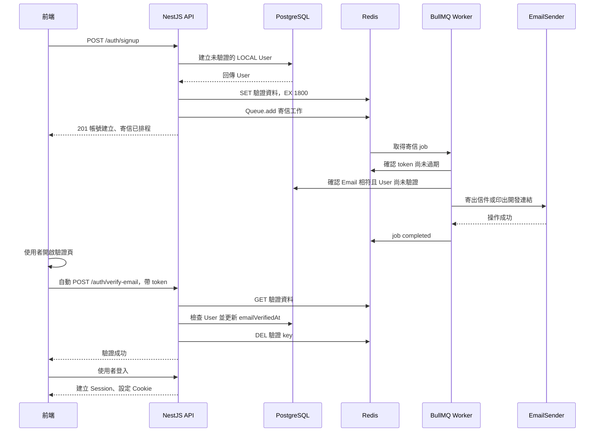

# Email 驗證、Redis Token 與 BullMQ Worker 規格

更新日期：2026-09-25。
狀態：待實作規格；本文不表示功能已完成。

## 目標與範圍

LOCAL 註冊帳號透過 Email 連結驗證信箱，驗證成功後才允許密碼登入。寄信工作交給 BullMQ Worker，API 不等待 SMTP 寄送完成。

第一版以學習與簡單實作為主：使用原生 BullMQ API 配合 NestJS module 與依賴注入，Worker 與 API 共用 backend 專案，但分別啟動為獨立 Node.js 進程。

已確認的設計：

- 驗證 token 存在 Redis，使用 TTL 自動過期，不新增 token 資料表。
- PostgreSQL 的 User.emailVerifiedAt 保存永久驗證狀態。
- 使用者開啟前端驗證頁後，頁面自動帶 token 呼叫驗證 API。
- SMTP 套件使用 Nodemailer，由 SmtpEmailSender 封裝。
- 開發環境注入 ConsoleEmailSender，在 Worker 終端機印出連結，不需要真實收件信箱。
- Google 登入由另外的流程處理；本規格先完成 LOCAL 驗證信。
- Workspace 邀請與現有站內通知不在本次實作範圍。

## 功能規則

| 項目 | 第一版規格 |
| --- | --- |
| 新註冊帳號 | authProvider = LOCAL，emailVerifiedAt = null |
| 驗證方式 | 隨機 token 組成的 Email 連結 |
| 有效期限 | token 寫入 Redis 起 30 分鐘 |
| 重寄冷卻 | 同一 Email 每 60 秒最多一次，搭配 API 請求限制 |
| 驗證成功 | 更新 emailVerifiedAt，顯示成功與登入入口 |
| 未驗證登入 | 密碼正確後回報 EmailVerificationRequired |
| 驗證頁與 API | 不要求先登入 |
| 寄信完成 | 表示寄送操作成功，不代表信件已送達或帳號已驗證 |

## 整體流程



## 資料分工

### PostgreSQL

沿用 User 欄位：

- id：系統內部 UUID，供所有關聯與 Session 使用。
- authProvider：LOCAL 或 GOOGLE。
- passwordHash：LOCAL 帳號需有值；Google 帳號可以為 null。
- emailVerifiedAt：null 表示尚未驗證，驗證成功後填入時間。
- googleSub：Google 帳號識別碼，與 User.id 分開。

本功能不建立 EmailVerificationToken table。

既有帳號在 migration 後可能仍是 emailVerifiedAt = null。正式啟用登入限制前，要決定讓既有帳號補驗證，或以一次性資料調整視為已驗證；不要讓所有新註冊帳號自動填入驗證時間。

### Redis 驗證資料

Key：

```text
auth:email-verification:{tokenHash}
```

Value 使用 JSON string：

```ts
type EmailVerificationData = {
  userId: string;
  email: string;
};
```

token 為 32 bytes 安全亂數的 hex 字串，tokenHash 使用 SHA-256。信件帶原始 token，Redis key 使用其雜湊。

```ts
import { createHash, randomBytes } from 'node:crypto';

const token = randomBytes(32).toString('hex');
const tokenHash = createHash('sha256').update(token).digest('hex');

// Redis 的 EX 單位是秒；寫入資料時一起設定 30 分鐘有效期限。
await redis.set(
  `auth:email-verification:${tokenHash}`,
  JSON.stringify({ userId: user.id, email: user.email }),
  { EX: 30 * 60 },
);
```

email 是這次要驗證的信箱快照。驗證時須與 User.email 相符；不能只依 userId 更新任意新信箱的驗證狀態。

Redis 的 BullMQ job 資料與驗證 token 是不同用途，使用各自的 key。工作 completed 不會自動消耗驗證 token。

## API 規格

### POST /auth/signup

沿用 email、password、name 輸入。

1. 檢查 Email 是否已註冊。
2. 雜湊密碼，建立 LOCAL User，emailVerifiedAt 保持 null。
3. 產生 token，寫入 Redis 驗證資料與 TTL。
4. 呼叫 EmailQueueService 加入寄信工作。
5. 入列成功後回傳 201，前端顯示待驗證畫面。

UserService／UserRepository 的建立方法需回傳 User 或至少 id、email，目前的 void 回傳不足以接續建立驗證資料。

資料庫寫入、Redis token 寫入及 Queue.add 不構成同一筆交易。User 建立後若後續步驟失敗，保留未驗證帳號，回報可辨識的寄信排程失敗結果，前端提供重寄入口；不要讓使用者反覆重新註冊。

### POST /auth/resend-verification-email

輸入：

```ts
type ResendVerificationEmailRequest = {
  email: string;
};
```

- 只有尚未驗證的 LOCAL 帳號會建立 token 並排入寄信工作。
- 不存在、Google 或已驗證帳號回傳一致的 202 文案：「若帳號符合條件，將寄出驗證信」。
- 同一 Email 設定 60 秒冷卻；API 另需限制 IP 請求頻率，確切額度在接入現有 API 限流時設定。
- 每次允許的重寄建立新 token；舊 token 在自己的 TTL 到期前仍有效。
- 任一 token 驗證成功後，其他 token 即使尚存在，也不能再次改寫驗證時間。
- 不必掃描 Redis 刪除所有舊 token，讓 TTL 清除；遇到已驗證 User 時，消耗目前 key 並回傳已驗證成功。
- Redis／Queue 的實際基礎設施故障須回報服務錯誤，不宣稱已成功排程。

### POST /auth/verify-email

輸入：

```ts
type VerifyEmailRequest = {
  token: string;
};
```

前端只傳 token；userId 和 Email 必須由後端取得 Redis 中的可信資料。

處理順序：

1. 驗證 token 的格式與長度，計算 SHA-256。
2. GET 對應 Redis key。
3. key 不存在時回報「連結無效或已過期」；可能原因包含到期、已消耗或不存在。
4. 查詢 User，確認 LOCAL 與 Email 相符。
5. User 尚未驗證時，以 id、email、authProvider 與 emailVerifiedAt = null 為更新條件，寫入驗證時間。
6. 更新成功，或確認相同信箱已驗證後，DEL 目前 token key。
7. 回傳 200，前端顯示驗證成功與登入入口。

條件更新結果為零時，重新確認 User 狀態；只有相同信箱已驗證才能視為成功，不能將任何零筆更新都當成成功。

此流程先成功更新 PostgreSQL，再刪除 token。不要先 GETDEL 消耗 token，再更新資料庫，否則資料庫失敗時會失去原本可重試的連結。

GET、資料庫更新、DEL 不是跨系統原子交易。第一版透過條件更新讓重複請求不重複改寫驗證時間：

- 資料庫更新失敗：保留 token，使用者可在 TTL 內重試。
- 資料庫已更新但 DEL 失敗：重試時確認已驗證，不再改寫時間，重新清除 key。
- token 已刪除後重新開啟連結：顯示連結無效或已過期，同時提供登入入口。

### POST /auth/login

執行順序：

```text
查詢 User
→ 確認 LOCAL 且 passwordHash 有值
→ 驗證密碼
→ 確認 emailVerifiedAt 有值
→ 建立 Session
```

帳號或密碼錯誤沿用 InvalidCredentials／401。密碼正確但未驗證時，規劃新增 EmailVerificationRequired／403，前端顯示驗證提示與重寄入口。錯誤代碼需同步到 packages/contracts。

## 前端驗證頁

連結形式：

```text
{FRONTEND_URL}/verify-email?token={token}
```

頁面載入後讀取 token，自動 POST /auth/verify-email，不需要額外按確認按鈕。

| 狀態 | 畫面 |
| --- | --- |
| 缺少 token | 連結無效，提供登入或重寄入口 |
| 請求中 | 正在驗證 Email |
| 成功 | 驗證成功，前往登入 |
| 無效／過期 | 提供重寄入口 |
| 網路或服務錯誤 | 提供重試 |

同一次頁面載入只發出一次自動驗證請求；網路失敗可以由使用者重試。驗證成功不自動建立登入 Session。

自動驗證的取捨：能執行頁面 JavaScript 的信件掃描工具可能提前觸發驗證。這是第一版已選擇的互動方式。

## Queue 與 Worker

### Queue 設定

| 項目 | 規格 |
| --- | --- |
| Queue 名稱 | email |
| Job 名稱 | send-verification-email |
| Job ID | verify-email-{tokenHash} |
| concurrency | 1 |
| attempts | 3，包含第一次執行 |
| backoff | exponential，delay = 5000；兩次重試約等待 5 秒、10 秒 |
| removeOnComplete | true |
| removeOnFail | 100 |

Job data：

```ts
type SendVerificationEmailJob = {
  email: string;
  token: string;
};
```

Queue 與 Worker 的名稱及 job 型別放在共用檔案，避免兩端拼字不一致。jobId 只使用 tokenHash，不放原始 token。

### Worker 處理順序

1. 由 job.token 計算 tokenHash，讀取 Redis 驗證資料。
2. token 不存在或過期時回傳 skipped。
3. 查詢 User，確認仍為 LOCAL、尚未驗證，且 User.email、Redis email 與 job.email 一致；不符時跳過寄送。
4. 使用固定 FRONTEND_URL 組成驗證連結。
5. await 注入的 EmailSender.sendVerificationEmail()。
6. 成功回傳 sent；寄送失敗拋出 Error，交由 BullMQ 重試。

每次重試沿用相同 token，不重新產生 token、不延長 TTL。Worker 不更新 emailVerifiedAt，也不消耗驗證 token。

Worker.on('completed')、Worker.on('failed')、Worker.on('error') 用於記錄處理結果。completed 可能是 sent 或 skipped，日誌需區分。

removeOnComplete = true 時，完成的 job 會移除，之後 getJob(jobId) 可能找不到資料；帳號是否已驗證以 PostgreSQL 為準。

### Redis 連線

使用目前已安裝的 bullmq 與 redis，以 createNodeRedisClient() 轉接 node-redis。

API Queue 與 Worker 各自管理 BullMQ 連線，可連到同一個 Redis 服務。現有 Session Redis client 保持原用途，避免把 Session 自訂 script 與 BullMQ 的生命週期綁在一起。

驗證 token 存取與 BullMQ 操作可共用 Redis 服務，但使用清楚分開的 key。建立 token 的 API 與讀取 token 的 Worker 必須使用相同 Redis DB。

API 入列失敗要能在有限等待後回報；Worker 可在 Redis 恢復後重新連線繼續等待工作。

### 啟動與關閉

- API 由 main.ts 啟動，提供 HTTP 與現有 Socket。
- Worker 由同層級的 worker.ts 啟動，使用 NestFactory.createApplicationContext(WorkerModule)，不呼叫 listen()。
- WorkerModule 載入自己的設定、Prisma、Redis 驗證資料存取與 EmailSender。
- WorkerModule 不載入整個 AppModule，避免把現有 Cron 排程一起啟動。
- 啟動與關閉使用 Nest 生命週期；Worker 關閉時先等待進行中的 job 收尾，再關閉依賴的連線。
- 規劃新增 dev:worker 啟動指令；確切 TypeScript 執行方式依 backend 現有編譯與路徑別名設定接入。

## NestJS 檔案分工

以下是預計新增的結構，實作時沿用專案命名慣例：

```text
backend/src/
├── main.ts
├── worker.ts
├── auth/
│   ├── auth.module.ts
│   ├── auth.controller.ts
│   ├── auth.service.ts
│   └── emailVerification.service.ts
├── email/
│   ├── emailJob.type.ts
│   ├── emailQueue.module.ts
│   ├── emailQueue.service.ts
│   ├── emailSender.module.ts
│   ├── emailSender.ts
│   ├── consoleEmailSender.ts
│   └── smtpEmailSender.ts
└── worker/
    ├── worker.module.ts
    └── email.processor.ts
```

| 元件 | 責任 |
| --- | --- |
| AuthService | 註冊與登入的業務流程 |
| EmailVerificationService | token 產生、Redis 保存／查驗／消耗、更新 User |
| EmailQueueService | 建立 Queue、封裝加入寄信工作 |
| EmailProcessor | 建立 BullMQ Worker、檢查工作是否仍有效、呼叫寄信介面 |
| EmailSenderModule | 根據設定注入寄信實作 |
| SmtpEmailSender | 使用 Nodemailer 寄信 |
| ConsoleEmailSender | 開發環境印出驗證連結 |

AuthModule 匯入 EmailQueueModule。WorkerModule 註冊 EmailProcessor，匯入必要依賴。API 與 Worker 是不同進程，各自有 Nest 依賴注入容器。

第一版不需要 QueueEvents 或 Socket 通知驗證結果；前端根據驗證 API 回應更新畫面。

## Nodemailer 與可替換寄信實作

安裝指令在 monorepo 根目錄執行：

```sh
pnpm --filter backend add nodemailer
pnpm --filter backend add -D @types/nodemailer
```

共用介面與 Nest injection token：

```ts
export const EMAIL_SENDER = Symbol('EMAIL_SENDER');

export interface EmailSender {
  sendVerificationEmail(
    email: string,
    verificationUrl: string,
  ): Promise<void>;
}
```

| EMAIL_TRANSPORT | 注入的實作 | 行為 |
| --- | --- | --- |
| console | ConsoleEmailSender | 只在 Worker 終端機印出測試連結 |
| smtp | SmtpEmailSender | 使用 Nodemailer 連到 SMTP server |

開發時可使用 tester@example.com 註冊，從終端機取得連結測完整驗證流程。不要透過把 emailVerifiedAt 自動填值來取代假寄信。

SmtpEmailSender 建立並重用 transporter。第一版使用純文字信件，不增加模板引擎：

```ts
const transporter = nodemailer.createTransport({
  host: smtpHost,
  port: smtpPort,
  secure: smtpPort === 465,
  auth: {
    user: smtpUser,
    pass: smtpPassword,
  },
});

await transporter.sendMail({
  from: mailFrom,
  to: email,
  subject: '驗證你的 Flowboard Email',
  text: `請開啟以下連結驗證 Email，連結有效期限為 30 分鐘：\n${verificationUrl}`,
});
```

設定值由 ConfigService 取得。465 使用直接 TLS；587 通常使用 STARTTLS，依 SMTP 提供者要求設定。sendMail 操作成功不保證進入收件匣，且不能因此更新 emailVerifiedAt。

Nodemailer 是 SMTP client 套件，正式寄信仍需 SMTP server／服務提供者。正式 SMTP 提供者尚待選擇，不能把安裝 Nodemailer 視為已具備寄送服務。

## 環境設定

| 設定 | 用途 |
| --- | --- |
| REDIS_URL | BullMQ 與驗證資料使用的 Redis |
| FRONTEND_URL | 驗證連結的固定前端來源 |
| EMAIL_TRANSPORT | console 或 smtp |
| EMAIL_VERIFICATION_TTL_SECONDS | 預設 1800 |
| SMTP_HOST | SMTP server |
| SMTP_PORT | SMTP port |
| SMTP_USER | SMTP 帳號 |
| SMTP_PASSWORD | SMTP 密碼／憑證 |
| MAIL_FROM | 寄件者 |

SMTP 設定只在 smtp 模式要求提供；正式環境使用 smtp，避免誤用 console 模式卻向使用者宣稱已寄信。

原始 token 存在 job data，因此 Redis 中的 job 也屬於敏感資料。一般日誌只記 jobId 和狀態；只有開發用 ConsoleEmailSender 印出完整連結，不將 token 回傳給註冊 API 呼叫者。

## 失敗與重複處理

| 情況 | 第一版行為 |
| --- | --- |
| Worker 停止 | 工作留在 Queue；恢復後處理 |
| 處理前 token 已過期 | Worker 跳過，使用者重寄 |
| SMTP 失敗 | 最多執行 3 次，之後保留 failed job |
| User 建立後 Redis 或入列失敗 | 保留未驗證帳號，明確回報排程失敗，提供重寄 |
| Redis token 遺失 | 驗證連結失效，使用者重寄 |
| 驗證時 DB 暫時失敗 | 不先刪 token，允許重試 |
| 驗證成功但 token 未刪除 | DB 條件更新避免重複改寫時間，再嘗試清除 |
| 寄信成功後 Worker 中斷 | 工作重跑可能寄出重複信；沿用同一 token |
| 重寄後多封信仍有效 | 任一連結成功後，User 狀態阻止再次更新驗證時間 |

第一版接受 DB 與 Redis 間沒有共同交易，以及 SMTP 可能重複寄信的限制。若日後需要保證每個帳號的寄信工作不漏，再另行設計 Outbox；本階段不加入。

## 實作順序

1. 建立 EmailQueueModule／Service 與獨立 Worker，跑通只印 job data 的練習工作。
2. 建立 EmailSender 介面與 ConsoleEmailSender，測試 Worker 依賴注入。
3. 完成 Redis token 保存、TTL 與驗證 API，確認資料庫更新與重複請求行為。
4. 將註冊、重寄接到 Queue；Worker 寄送前檢查 token 與 User 狀態。
5. 完成待驗證畫面與自動驗證頁，處理既有帳號政策後再啟用登入限制。
6. 加入 SmtpEmailSender 與 Nodemailer，切換設定驗證真實寄信與失敗重試。

## 驗收條件

- 新註冊 LOCAL User 的 emailVerifiedAt 為 null。
- Redis token 有 TTL，逾時後無法驗證。
- Worker 未啟動時 job 等待，啟動後才開始處理。
- console 模式不寄出真實郵件，但可取得連結完成驗證。
- 前端開啟驗證頁會自動帶 token POST API。
- 驗證成功才更新 emailVerifiedAt；單純 job completed 不會更新。
- 密碼正確但未驗證時不能建立 Session；驗證後可登入。
- 重複／並行驗證不重複改寫 emailVerifiedAt。
- 錯誤、過期或 Email 不相符的 token 無法驗證其他信箱。
- DB 更新失敗時 token 仍可重試。
- Worker 遇到過期或已驗證帳號時跳過寄送。
- 用 Fake sender 模擬 SMTP 失敗，確認重試次數與間隔。
- SMTP 與 Console sender 可透過設定切換，Queue 與驗證流程不需改寫。

## 參考文件

- [Redis SET 與 EX](https://redis.io/docs/latest/commands/set/)
- [Redis GETDEL](https://redis.io/docs/latest/commands/getdel/)
- [BullMQ Redis 連線與 node-redis adapter](https://docs.bullmq.io/guide/connections)
- [BullMQ 失敗重試](https://docs.bullmq.io/guide/retrying-failing-jobs)
- [NestJS standalone application](https://docs.nestjs.com/standalone-applications)
- [Nodemailer SMTP transport](https://nodemailer.com/smtp)
