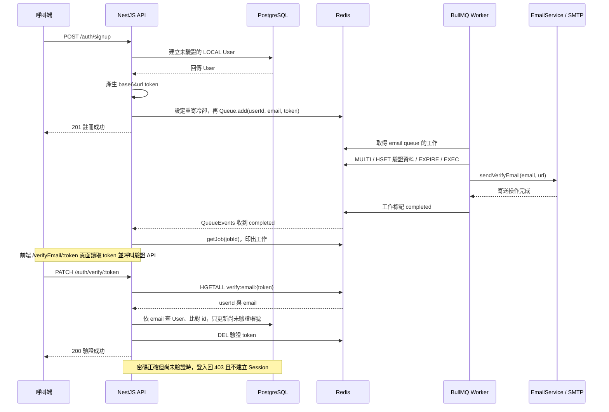

# Email 驗證、Redis Token 與 BullMQ Worker 流程

更新日期：2026-09-28。
狀態：依目前程式碼整理的實作說明；待實作項目另列於文末。

## 目前範圍與進度

已實作 LOCAL 註冊入列、Worker 保存驗證資料並寄信、驗證 API、重寄與冷卻、註冊部分成功回應，以及未驗證帳號的登入限制。

- 驗證 token 存在 Redis，使用 TTL 自動過期，不新增 token 資料表。
- PostgreSQL 的 `User.emailVerifiedAt` 保存驗證時間。
- 使用原生 BullMQ API 與 NestJS 依賴注入；API、Worker 共用 backend 專案，但分別啟動為獨立 Node.js 進程。
- 使用 Nodemailer，由 `EmailService` 直接連 SMTP 寄信。
- 前端 `/checkEmail` 提示／重寄頁與 `/verifyEmail/:token` 驗證頁已實作；console 寄信模式尚未實作。
- Google 登入、Workspace 邀請與站內通知不在本次流程範圍。

API 沿用 `code / data / message / time / error` 格式。倒數資訊放在 `data.retryAfterSeconds`，不使用自訂回應 header。SMTP 真實寄信先前已由使用者確認；自動化 E2E 使用真實 PostgreSQL、Redis、BullMQ 與 Worker，SMTP 邊界替換成收集信件的測試實作。

## 整體流程


```mermaid
sequenceDiagram
    participant C as 呼叫端
    participant A as NestJS API
    participant D as PostgreSQL
    participant R as Redis
    participant W as BullMQ Worker
    participant M as EmailService / SMTP

    C->>A: POST /auth/signup
    A->>D: 建立未驗證的 LOCAL User
    D-->>A: 回傳 User
    A->>A: 產生 base64url token
    A->>R: 設定重寄冷卻，再 Queue.add(userId, email, token)
    A-->>C: 201 註冊成功

    W->>R: 取得 email queue 的工作
    W->>R: MULTI / HSET 驗證資料 / EXPIRE / EXEC
    W->>M: sendVerifyEmail(email, url)
    M-->>W: 寄送操作完成
    W->>R: 工作標記 completed
    R-->>A: QueueEvents 收到 completed
    A->>R: getJob(jobId)，印出工作

    Note over C,A: 前端 /verifyEmail/:token 頁面讀取 token 並呼叫驗證 API
    C->>A: PATCH /auth/verify/:token
    A->>R: HGETALL verify:email:{token}
    R-->>A: userId 與 email
    A->>D: 依 email 查 User、比對 id，只更新尚未驗證帳號
    A->>R: DEL 驗證 token
    A-->>C: 200 驗證成功
    Note over A,D: 密碼正確但尚未驗證時，登入回 403 且不建立 Session
```

API 等待入列成功，不等待 SMTP 寄送完成。註冊回傳成功、寄信工作 completed、使用者完成信箱驗證，是三個不同的時間點。

## 檔案與職責

```text
backend/src/
├── main.ts
├── auth/
│   ├── auth.module.ts
│   ├── auth.controller.ts
│   └── auth.service.ts
├── queue/
│   ├── queue.module.ts
│   └── queue.service.ts
├── worker/
│   ├── main.ts
│   ├── worker.module.ts
│   └── worker.service.ts
├── email/
│   ├── email.module.ts
│   └── email.service.ts
├── redis/
│   ├── redis.module.ts
│   ├── redis.service.ts
│   └── redis.keys.ts
├── types/
│   └── queue.ts
└── user/
    ├── user.service.ts
    └── user.repository.ts
```

| 元件 | 目前責任 |
| --- | --- |
| AuthService | 註冊與重寄入列、Redis 冷卻、驗證 token、登入前檢查驗證狀態 |
| QueueService | 建立 email Queue、提供入列方法、用 QueueEvents 監聽 completed |
| WorkerService | 建立 Worker、寫入 Redis hash 與 TTL、組合網址並呼叫 EmailService |
| EmailService | 建立 Nodemailer transporter，寄出含驗證網址的 HTML 信 |
| RedisService | 提供一般 Redis client 與獨立的 BullMQ client |
| UserService / UserRepository | 查詢 User，以及更新 emailVerifiedAt |

`AuthModule` 匯入 `QueueModule` 與 `RedisModule` 等依賴。`WorkerModule` 只匯入 `ConfigModule`、`RedisModule`、`EmailModule`，註冊 `WorkerService`；目前 Worker 不查資料庫，也沒有載入 PrismaModule 或 AppModule。

## 註冊與入列

端點：`POST /auth/signup`。

輸入為 `email`、`password`、`name`。SignupDto 會整理 Email 與名稱，並驗證輸入格式。

1. `AuthService.signup()` 依 Email 查詢 User；已存在則由 controller 回傳 409、`EmailAlreadyRegistered`。
2. 雜湊密碼，再透過 UserService / UserRepository 建立 User。
3. 依 Prisma schema 預設值，`authProvider = LOCAL`，`emailVerifiedAt = null`；建立方法會回傳 User。
4. 以 `randomBytes(32).toString('base64url')` 產生 token。
5. 用 `SET EX` 設定首次寄信的冷卻，再呼叫 `QueueService.addVerificationEmailQueue(payload)`。
6. 入列完成後回傳 201、`Success`，data 為 `{ accountCreated: true, emailQueued: true, retryAfterSeconds: 60 }`（秒數依設定）。回應不包含 token，也不建立登入 Session。

Job data 定義在 `backend/src/types/queue.ts`：

```ts
export type SendVerificationEmailData = {
  userId: string;
  email: string;
  token: string;
};
```

目前 API 只產生 token 並放入 job。驗證用 Redis hash 由 Worker 執行工作時建立；Worker 尚未啟動時，工作會等待，驗證資料尚未建立。

User 建立與 Queue.add 不屬於同一筆交易。建立 User 後，若 Redis 冷卻設定或入列失敗，仍回傳 HTTP 201，但 code 為 `SignupEmailQueueFailed = 2007`，data 為 `{ accountCreated: true, emailQueued: false, retryAfterSeconds }`。前端應提示帳號已建立並提供重寄，不能要求重新註冊。

失敗時保留原有冷卻，回傳 Redis 的剩餘 TTL；Redis 本身故障時使用設定值作為建議等待時間。帳號建立前的 DB 故障仍是 500。Worker 後續 SMTP 失敗不屬於此結果，因為此時 API 入列已成功。

## Queue、Worker 與事件

| 項目 | 目前設定 |
| --- | --- |
| Queue 名稱 | `email` |
| Job 名稱 | `send-verification-email` |
| Job ID | 沒有自訂，交由 BullMQ 產生 |
| concurrency | 沒有設定，使用 BullMQ 預設值 |
| attempts / backoff | 沒有設定寄信失敗的自動重試次數與間隔 |
| removeOnComplete / removeOnFail | 沒有設定完成或失敗工作的自動清除 |
| QueueEvents | 在 API 進程監聽 `completed`，取得 job 後印出 |
| Worker 事件處理 | 目前未註冊 `completed`、`failed`、`error` 的自訂監聽器 |

Queue 與 Worker 的名稱目前分別寫在各自的 service；只有 job data 型別抽到共用檔案。

Worker 在 `onModuleInit()` 建立，收到工作後印出 `job.id`、`job.name`、`job.data`。工作名稱符合時，執行 `handleSendVerificationEmail()`：

1. 從 job data 取得 `userId`、`email`、`token`。
2. 取得一般 Redis client，寫入驗證 hash 及 TTL。
3. 透過 `EmailService.sendVerifyEmail(email, url)` 寄信，並等待 Promise 完成。
4. processor 完成後由 BullMQ 標記 completed。寄信拋出錯誤時，processor 也會失敗；目前沒有配置該失敗的自動重試。

Worker 不檢查 User 是否仍存在、是否已驗證，也不在寄信前查驗既有 token。若同一工作再次執行，會重新 HSET 並設定完整 TTL。目前沒有 `sent` 或 `skipped` 回傳值。

QueueEvents 的 completed 只用於觀察工作結果，沒有透過 Socket 通知前端，也不更新 `emailVerifiedAt`。測試階段保留完整 job 的 console 輸出。

## Redis 驗證資料

Key 由 `redisKeys.verifyEmail(token)` 組成：

```text
verify:email:{token}
```

目前直接使用原始 base64url token，不另外做 SHA-256。資料型態為 Redis hash：

| 欄位 | 內容 |
| --- | --- |
| userId | 註冊時建立的 User.id |
| email | 這次寄送驗證信的 Email |

Worker 使用一般 Redis client 寫入：

```ts
// TTL 單位為秒；設定中的有效期限單位為分鐘。
const expireSeconds = verifyMailExpireMinute * 60;

// 用同一個 Redis transaction 寫入 hash 並設定 TTL。
await redisClient
  .multi()
  .hSet(redisKey, { userId, email })
  .expire(redisKey, expireSeconds)
  .exec();
```

有效期限來自 `VERIFY_MAIL_EXPIRE_MINUTE`，預設 30 分鐘。TTL 從 Worker 寫入 Redis 時開始計算，包含之後等待 SMTP 寄送的時間；不是從 API 接到註冊請求時開始。

驗證 hash 與 BullMQ 的 job 是不同資料。完成 job 不會刪除驗證 hash；hash 到期也不會刪除 job。

## 寄信與連結

EmailService 在 `onModuleInit()` 建立並重用 Nodemailer transporter。設定使用 `SMTP_HOST`、`SMTP_PORT`、`SMTP_USER`、`SMTP_PASSWORD`，目前 `secure: true` 固定開啟直接 TLS，範例設定使用 465。

信件內容：

- 寄件者：`MAIL_FROM`。
- 收件者：job data 的 `email`。
- 主旨：`Flowboard - 驗證你的帳號`。
- 格式：HTML，含歡迎文字、驗證連結及有效分鐘數；目前沒有 text 版本。

連結由 Worker 組成：

```text
{FRONTEND_URL}/verifyEmail/{token}
```

這是前端網址。使用者點擊連結後，前端頁面讀取 token 並自動呼叫 `PATCH /auth/verify/:token`；成功後顯示驗證完成畫面與前往登入的按鈕。

EmailService 目前直接使用 SMTP；沒有 EmailSender 介面、ConsoleEmailSender 或依設定切換 provider。`EMAIL_TRANSPORT` 雖存在環境設定中，尚未用於切換寄信行為。

## 驗證 API

端點：`PATCH /auth/verify/:token`，公開端點，不需先登入。

1. 以 token 讀取 Redis hash；缺少 userId 或 email 表示連結不可用。
2. 以 email 查 User，確認 userId 相符且 authProvider 為 LOCAL。
3. 尚未驗證才呼叫更新；repository 用 `updateMany` 加上 `emailVerifiedAt: null` 條件，並行請求也不重寫第一次驗證時間。
4. DB 成功後刪除這次 Redis token，再回 200；不建立 Session。
5. 已驗證帳號若使用另一封仍有效的信，回成功並刪除該 token，保留原驗證時間。同一 token 消耗後再使用則回連結無效。

不存在、過期、已使用或不匹配的連結回 400、`AuthVerifyFail = 2004`。Redis 與 DB 故障直接交給原本的 filter，回 500、`InternalError`，不冒充連結無效。

DB 更新成功但 Redis 刪除失敗時回 500；再次驗證會保留既有驗證時間並重試刪除 token。兩個儲存系統之間仍沒有跨系統交易。

## 重寄 API

端點：`POST /auth/resend-verification-email`，body：`{ "email": "user@example.com" }`。

DTO 會 trim、轉小寫並驗證 email。所有格式合法的 email 都用 Redis `SET NX EX` 原子取得冷卻資格，預設 60 秒；只有存在、尚未驗證的 LOCAL 帳號會入列。

| 情況 | HTTP / code | data |
| --- | --- | --- |
| 申請受理 | 202 / Success | `{ retryAfterSeconds: 60 }`，依設定 |
| 冷卻中 | 429 / EmailVerificationCooldown（2006） | `{ retryAfterSeconds: 剩餘TTL }` |
| 重寄入列失敗 | 503 / VerificationEmailQueueFailed（2008） | `{ retryAfterSeconds: 剩餘TTL }` |
| Redis / DB 等服務故障 | 500 / InternalError | null |

不存在、已驗證及 Google 帳號回相同受理文案與倒數：「若此信箱有尚未驗證的帳號，我們會寄送驗證信。」實際排信仍依帳號條件判斷。冷卻資訊由 AuthService 寫入；Worker 只寫 token hash 與驗證期限。

## 登入限制

`POST /auth/login` 先比對帳號、LOCAL provider 與密碼。密碼錯誤回 401 / InvalidCredentials。

密碼正確但 `emailVerifiedAt === null` 時，回 403 / `EmailVerificationRequired = 2005`，data 為 `{ email }`；不建立 Session，也不設定 Cookie。前端可依此 code 轉到驗證信頁。已驗證帳號才繼續既有 Session / Cookie 流程。

## 共用 contracts

`packages/contracts/auth.ts` 提供 SignupResult、ResendVerificationEmailRequest、ResendVerificationEmailResult、VerificationEmailCooldown 與 EmailVerificationRequiredData。結果碼集中在 `packages/contracts/api.ts`。

HTTP 201 的 SignupEmailQueueFailed 表示帳號建立成功但排信失敗；前端需同時判斷 code 與 data.emailQueued，不能只判斷 HTTP 是否成功。emailQueued 不表示 SMTP 已投遞。

## Redis 連線與進程生命週期

RedisService 建立兩個 client：

- `getClient()`：一般 node-redis client，供 Session 與驗證資料使用。
- `createBullMQConnection()`：回傳預先建立、經 `createNodeRedisClient()` 轉接的獨立 BullMQ client；方法每次呼叫不會建立新 client。

兩者都使用 `REDIS_URL`。API 與 Worker 是不同進程，各自有 Nest DI 容器與 RedisService 實例；Worker 寫入的驗證資料必須能由 API 讀取，因此需連至同一個 Redis DB。

API 內的 Queue 與 QueueEvents 都使用 RedisService 提供的 BullMQ connection。一般 client 在 RedisService 初始化時 connect，銷毀時 quit。

- API 的 QueueService 銷毀時先關閉 QueueEvents，再關閉 Queue 與 BullMQ client。
- WorkerService 銷毀時呼叫 Worker.close，再關閉 BullMQ client。
- API 與 Worker 入口都啟用 Nest shutdown hooks。
- Worker 入口是 `src/worker/main.ts`，透過 `createApplicationContext(WorkerModule)` 啟動，不呼叫 listen，也不開 HTTP server。

## 環境設定與啟動

API 與 Worker 都使用同一份 envSchema。一般讀取 backend/.env；`E2E_ENV=true` 時讀取 backend/.env.e2e。

| 設定 | 目前用途 |
| --- | --- |
| DATABASE_URL | API 使用的 PostgreSQL；共用 schema 也要求 Worker 啟動時提供 |
| REDIS_URL | 一般 Redis client 與 BullMQ client 的連線位置 |
| FRONTEND_URL | 信件中的前端來源，也用於 API / Socket 設定 |
| VERIFY_MAIL_EXPIRE_MINUTE | 驗證資料有效分鐘數，正整數，預設 30 |
| RATE_LIMIT_VERIFY_EMAIL_SECONDS | 註冊與重寄的冷卻秒數，正整數，預設 60 |
| EMAIL_TRANSPORT | schema 要求提供字串，尚未控制寄信行為 |
| SMTP_HOST / SMTP_PORT | SMTP 主機與連接埠 |
| SMTP_USER / SMTP_PASSWORD | SMTP 帳號與密碼 |
| MAIL_FROM | 信件寄件者 |

SMTP 相關欄位目前都列在共用 schema，沒有依 EMAIL_TRANSPORT 做條件驗證。範例檔使用佔位值；e2e SMTP 設定是測試值，不是可正常寄信的 SMTP 服務。

在 monorepo 根目錄啟動：

```sh
docker compose up -d
pnpm run dev:backend
```

另一個終端機啟動 Worker：

```sh
pnpm run dev:worker
```

再開一個終端機啟動前端：

```sh
pnpm run dev:frontend
```

根目錄的 dev:worker 會執行 backend 的 `nest start --watch --entryFile worker/main`。只啟動 dev:backend 不會執行 WorkerModule。

## 目前可手動確認的流程

以下是操作步驟。使用者已回報完成真實寄信與前後端驗證流程；文件更新時未重新執行。使用尚未註冊且能收信的測試信箱。下方使用 `backend/.env.example` 的 `PORT=4001`；若本機 `.env` 設了其他 PORT，請改用實際值。

```sh
curl -X POST http://localhost:4001/v1/api/auth/signup \
  -H 'Content-Type: application/json' \
  -d '{"email":"your-email@example.com","password":"password123","name":"Test"}'
```

確認註冊回傳 201、Worker 處理工作、API 收到 completed，並實際收到信件。開啟信件中的前端 `/verifyEmail/:token` 連結，頁面會自動呼叫驗證 API。若要單獨檢查 API，可改用下列指令；同一個 token 成功使用後不可再次驗證。

```sh
curl -X PATCH 'http://localhost:4001/v1/api/auth/verify/替換成信件中的token'
```

核對：

1. 註冊後 User 的 emailVerifiedAt 為 null；工作完成與收到信不會改變它。
2. Worker 寫入的 Redis hash 含 userId、email，TTL 為正值。
3. 有效 token 回傳驗證成功，emailVerifiedAt 更新為時間。
4. 不存在或已過期 token 回傳驗證失敗，不更新 User。
5. 同一 token 成功後再次提交回 400；另一封有效信可回 200，驗證時間保持不變。
6. 未驗證登入回 403；完成驗證後能登入並建立 Session。
7. 重寄受理回 202 與倒數，冷卻內再呼叫回 429，倒數都在 data 中。

## 自動化測試

在專案要求的 Node 24 執行：

```sh
pnpm run build:contracts
pnpm --filter backend test --runInBand
pnpm run test:backend:e2e
```

E2E runner 使用 compose.e2e.yml 的獨立 PostgreSQL / Redis、套用測試 migration，完成後清理測試容器。auth.e2e.spec.ts 啟動真正的 API 與 Worker 的 Nest DI context，僅將 EmailService 換成測試替身；涵蓋入列、Worker 寫入 Redis、取得信件 token、重寄、驗證、登入與登出。

測試也涵蓋並行驗證、舊 token 不改寫時間、無效與過期 token、DB / Redis 故障、入列失敗後重寄恢復，以及 API 回應格式。其他功能的 E2E 測試使用已驗證帳號 fixture，避免登入限制影響工作區／專案測試。

## 後續工作

1. 需要時增加 Worker 寄信失敗的自動重試、投遞狀態追蹤。
2. 需要免真實寄信的開發模式時，加入 console / SMTP 實作切換；目前 EMAIL_TRANSPORT 尚未控制寄信行為。

## 程式碼對照

- [註冊、登入與驗證 service](../backend/src/auth/auth.service.ts)
- [Auth controller](../backend/src/auth/auth.controller.ts)
- [Queue service](../backend/src/queue/queue.service.ts)
- [Worker service](../backend/src/worker/worker.service.ts)
- [Email service](../backend/src/email/email.service.ts)
- [Redis service](../backend/src/redis/redis.service.ts)與 [Redis keys](../backend/src/redis/redis.keys.ts)
- [User repository](../backend/src/user/user.repository.ts)與 [Prisma schema](../backend/prisma/schema.prisma)
- [Job data 型別](../backend/src/types/queue.ts)
- [環境設定 schema](../backend/src/config/env.ts)
- [前端 router](../frontend/src/router/index.ts)與 [Auth API service](../frontend/src/services/auth.ts)

## 設計前文件對照（2026-09-27）

HTTP request、status、code、data 與錯誤範例以 [目前 HTTP API](http-api.md#auth-api-詳細規格) 為串接依據；畫面缺口見 [功能盤點](feature-readiness.md)。本文件中的後端已實作行為不代表前端頁面已完成。API 尚未提供驗證到期時間、jobId 或 SMTP 狀態，SVG 不能依賴這些未提供的欄位。
